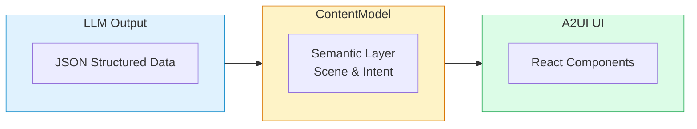

# Ahead of Google's Official Release! We Open-Sourced the First Complete A2UI React Implementation

> When AI no longer just outputs text, but directly "draws" interfaces

---

## What is A2UI?

**In December 2025**, Google officially released a revolutionary open protocol — **A2UI (Agent-to-User Interface)**.

What does this mean?

Imagine: when you chat with AI, it no longer just returns a block of text, but directly returns a **complete interactive interface** — with buttons, cards, forms, and charts. Users can directly click, fill in, and interact, instead of copying and pasting a large block of text.

**This is the problem that the A2UI protocol aims to solve.**

---

## Why is A2UI So Important?

### Pain Points of Traditional AI Interaction

> **User**: Generate a report for me
> 
> **AI**: Okay, here's the report content... *[A large block of plain text]* ...Let me know if you need any changes

Users need to:
- Copy and paste text
- Format it themselves
- Have multiple conversations to make revisions

### Interaction in the A2UI Era

> **User**: Generate a report for me
> 
> **AI**: *[Directly renders the report interface]*
> - Includes charts
> - Editable tables
> - One-click export button
> - Real-time modification feedback

**This is not a concept, this is reality.**

---

## What Did We Do? First to Implement the React Version

According to Google's official roadmap:

| Timeline | Milestone |
| --- | --- |
| 2025.12 | A2UI Protocol Released (v0.8 Public Preview) |
| **2026 Q1** | **Official React Renderer Release** |
| 2026 Q2 | SwiftUI / Jetpack Compose Renderers |
| 2026 Q4 | v1.0 Stable Release |

**However, we couldn't wait.**

The Zhama AI team, based on the A2UI protocol specification, **before the official React renderer release**, open-sourced the first complete React implementation:

**[@zhama/a2ui](https://github.com/zhama-ai/a2ui-react)**

---

## @zhama/a2ui Core Features

### AI-First Design

Designed specifically for AI agents to dynamically generate UI. Instead of having developers write components manually, AI outputs structured data that automatically renders.

### Complete Protocol Support

100% implementation of the A2UI protocol specification, including:
- All standard component types
- Data binding and path references
- Event handling and action system
- Surface management

### Independent Styling System

- **Zero Tailwind dependency** — Comes with a complete CSS utility class system
- **`a2-` prefix** — Avoids conflicts with host applications
- **Automatic dark mode** — Uses CSS `light-dark()` function
- **OKLCH color space** — Modern color system

### Security First

Uses declarative data format rather than executable code:
- AI can only use predefined components
- No code injection risk
- Fully controllable UI rendering

### Rich Component Library

| Component | Purpose |
| --- | --- |
| **Text** | Text rendering with Markdown support |
| **Button** | Interactive button with actions |
| **Card** | Content card container |
| **List** | Vertical/horizontal lists |
| **TextField** | Text input field |
| **Checkbox** | Checkbox |
| **Tabs** | Tab switching |
| **Modal** | Modal dialog |
| **Chart** | Data charts |
| **Image/Video/Audio** | Multimedia components |

### High Performance

- Follows React best practices
- Optimized re-rendering strategy
- Supports streaming rendering

### Complete TypeScript Support

- Comprehensive type definitions
- Intelligent code completion
- Compile-time error checking

---

## See It in Action

### Scenario 1: AI Training Assistant

User inputs `hello`, AI directly generates a welcome interface with themed cards:

> **Welcome to the AI Training System**
> 
> Includes course cards (React Basics, Python Advanced), Start buttons, real-time progress bar showing 80%

### Scenario 2: Interactive Forms

When AI needs to collect user information, it directly generates a form:

> **Please fill in the following info**
> 
> Includes name input, email input, newsletter subscription checkbox, Cancel/Submit buttons

### Scenario 3: Data Visualization

After AI analyzes data, it directly displays charts:

> **Sales Data Analysis**
> 
> Includes monthly trend bar chart, category distribution pie chart, AI insight: "March sales up 25% MoM"

---

## 5-Minute Quick Start

### Installation

```bash
npm install @zhama/a2ui
# or
pnpm add @zhama/a2ui
```

### Basic Usage

```tsx
import { StyleProvider, ThemeProvider, A2UIRoot } from '@zhama/a2ui';

function App() {
  // Component structure output by AI
  const components = [
    {
      id: 'welcome',
      type: 'Card',
      properties: {
        child: {
          id: 'content',
          type: 'Column',
          properties: {
            children: [
              {
                id: 'title',
                type: 'Text',
                properties: {
                  text: { literal: 'Welcome to A2UI!' },
                  usageHint: { literal: 'h1' }
                }
              },
              {
                id: 'action',
                type: 'Button',
                properties: {
                  child: {
                    id: 'btn-text',
                    type: 'Text',
                    properties: { text: { literal: 'Get Started' } }
                  },
                  action: { type: 'postback', payload: 'start' }
                }
              }
            ]
          }
        }
      }
    }
  ];

  return (
    <StyleProvider>
      <ThemeProvider>
        <A2UIRoot 
          childComponents={components}
          onAction={(e) => console.log('User clicked:', e)}
        />
      </ThemeProvider>
    </StyleProvider>
  );
}
```

### Run the Demo

```bash
# Clone the repository
git clone https://github.com/zhama-ai/a2ui-react.git
cd a2ui-react

# Run the example
cd examples/basic-demo
npm install
npm run dev
```

Open http://localhost:5174 to experience the full demo!

---

## Use Cases

### AI Education & Training

- Dynamically generate course content
- Interactive quizzes and assessments
- Personalized learning paths
- Real-time progress tracking

### Intelligent Customer Service

- Form-based information collection
- Product card recommendations
- Multi-step guided flows
- Visual data presentation

### Business Intelligence

- AI-driven report generation
- Dynamic dashboards
- Approval workflows
- Data entry forms

### Developer Tools

- Interactive documentation
- Configuration wizards
- Debug interfaces
- Code generation preview

---

## Architecture Design

A2UI adopts a two-layer architecture, letting AI focus on content while the framework focuses on rendering:



**Core Advantages:**
- **Separation of Concerns** — LLM doesn't need to worry about UI details
- **Flexibility** — Switching rendering frameworks doesn't require changing prompts
- **Security** — Declarative data, no code execution
- **Testability** — Content logic and UI can be tested independently

---

## Why Choose @zhama/a2ui?

| Feature | @zhama/a2ui | Waiting for Official |
| --- | --- | --- |
| Availability | **Now** | 2026 Q1 |
| React 18 Support | Supported | - |
| Complete Component Library | 15+ components | - |
| TypeScript | 100% | - |
| Independent Styling System | Supported | - |
| English Documentation | Supported | - |
| Open Source License | MIT | - |
| Production Ready | Supported | - |

---

## Contributing

We welcome community participation! Whether it's:
- Submitting Issues
- Feature Suggestions
- Improving Documentation
- Submitting PRs

All are very welcome!

**GitHub Repository:** https://github.com/zhama-ai/a2ui-react

---

## Resources

- **NPM Package**: [@zhama/a2ui](https://www.npmjs.com/package/@zhama/a2ui)
- **Full Documentation**: [GitHub README](https://github.com/zhama-ai/a2ui-react)
- **Online Demo**: [examples/basic-demo](https://github.com/zhama-ai/a2ui-react/tree/main/examples/basic-demo)
- **A2UI Official Protocol**: [a2ui.org](https://a2ui.org)
- **Google's Blog Post**: [developers.googleblog.com](https://developers.googleblog.com/introducing-a2ui-an-open-project-for-agent-driven-interfaces/)

---

## Future Outlook

A2UI represents the future direction of AI interaction. As the protocol matures, we will continue to:

- Follow A2UI protocol version updates
- Expand more component types
- Provide more theme options
- Optimize mobile experience
- Add plugin extension capabilities

---

## Final Words

**The AI era has arrived, but the way AI expresses itself is still evolving.**

From plain text → Markdown → Structured data → **Dynamic interactive interfaces**

A2UI allows AI to not just "say", but truly "do".

**Start using @zhama/a2ui now and give your AI applications true interactive capabilities!**

```bash
npm install @zhama/a2ui
```

---

**If you find this helpful, please give us a Star!**

[GitHub](https://github.com/zhama-ai/a2ui-react) | [NPM](https://www.npmjs.com/package/@zhama/a2ui) | [Documentation](https://github.com/zhama-ai/a2ui-react#readme)

Made with love by [Zhama AI](https://zhama.com)

---

*This article was first published on Zhama AI's official blog. Please credit the source when republishing.*

---

## Appendix: FAQ

### Q: What's the difference between A2UI and regular React components?

A2UI components are designed specifically for dynamic generation by AI. AI outputs structured data (JSON), not code. This means:
- More secure (no code injection risk)
- More flexible (data-driven, easy to modify)
- More suitable for AI (LLMs are good at generating structured data)

### Q: Can I use A2UI without AI?

Yes! Although A2UI is designed for AI, you can completely build ComponentNode structures manually. It's just more cumbersome than traditional React development.

### Q: Which LLMs are supported?

Any LLM that can output JSON works:
- GPT-4 / GPT-3.5 (OpenAI)
- Claude 3 (Anthropic)
- Gemini Pro (Google)
- Various open-source models

### Q: How do I customize styles?

A2UI provides multiple customization methods:
1. Override component styles through the `ThemeProvider`'s `theme` property
2. Directly override CSS variables
3. Add custom CSS classes

### Q: Is it production-ready?

Yes! @zhama/a2ui is already being used in multiple production applications and is stable and reliable. We follow semantic versioning to ensure smooth upgrades.
