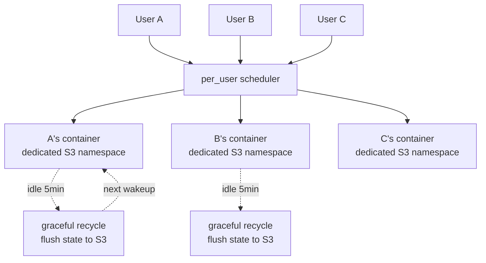
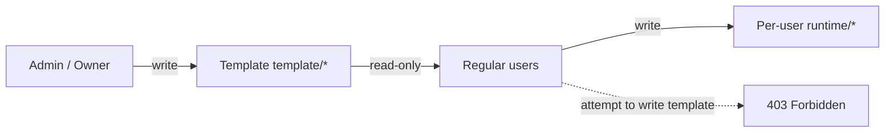

# Tego OS v3.0.0 Released: One Digital Avatar a Whole Team Can Truly Share

> The same digital avatar can be safely used by a whole team — without anyone stepping on anyone else.

---

## What actually shipped

If we had to compress Tego OS v3.0.0 into a single sentence, it would be:

> **One digital avatar can be safely used by a whole team — without anyone stepping on anyone else.**

Through the v2.x line we proved that an enterprise digital avatar can be built, deployed, and connected to WeCom / DingTalk / Lark / Slack, that it can mount skills and consume external data sources. But the moment you tried to put one into front-line production — a support center, an IT helpdesk, a cross-border e-commerce ops team — four old problems hit:

1. **Concurrency causes interference.** Multiple users share the same runtime; sessions, memory and files step on each other.
2. **Data slicing is too coarse.** S3 storage is a "single shared pot," making per-user backup / restore / destroy nearly impossible.
3. **Anyone can change anything.** Templates, skills and prompts can be written by anyone, leading to overwrites and version drift.
4. **Operations are flying blind.** How many people are really active? How well are skills performing? Everything has to be pulled by hand.

v3.0.0 is not "a few more features." It is a full-stack rewrite aimed at exactly those four problems:

- **Architecture** — `per_user` dedicated instances: every user gets their own container of the same avatar.
- **Data** — Three-layer S3 namespace: template / shared / per-user are strictly separated.
- **Governance** — Single authority over templates and runtime: regular users get 403 if they try to write template paths.
- **Observability** — A brand-new BusinessMonitor dashboard: platform health, coverage, growth, engagement, workflow and skill effectiveness all on one screen.
- **Experience** — Mini Chat floating window, unified Downloads center, and a fully rewritten Windows NSIS installer.
- **Ecosystem** — 16 ready-to-use Tego template skills (11 IT-ops + 5+ cross-border e-commerce).

The goal: turn a product that runs into a system enterprises can truly deliver against.

---

## Four watersheds: v2.x → v3.0.0

| Dimension | v2.x (before) | v3.0.0 (now) |
|---|---|---|
| **Concurrency** | Multiple users on a shared runtime; sessions and memory leak across | `per_user` dedicated instances; one runtime per user |
| **Data isolation** | S3 single shared pot; restore / destroy not user-level | Templates and runtime separated by prefix; per-user backup / restore / destroy |
| **Configuration governance** | Anyone can change anything; conflicts everywhere | Template single authority; regular users writing template paths get 403 |
| **Operational observability** | Metrics scattered across multiple analytics warehouses | BusinessMonitor dashboard: coverage, growth, engagement, workflow, skills on one screen |

These four are a single package — none of them alone is enough to put an avatar into production.

---

## Capability one: `per_user` dedicated instances

### The pain

In v2, one avatar mapped to one container, and all users shared the same runtime state. For a support center or an IT helpdesk where dozens of people use the same avatar at once, sessions and workspaces overwrote each other. Real production was practically impossible.

### How v3.0.0 solves it

Avatars now carry an `instanceMode` field:

- `shared` (default) — preserves v2 behavior;
- `per_user` — every user gets a dedicated instance container plus a dedicated S3 namespace.

### Six guardrails

1. **Per-user dedicated container** on first connection, bound to a dedicated S3 namespace.
2. **Idle auto-reclaim** — after 5 minutes of inactivity the container gets a 45-second graceful shutdown to flush state to S3, then sub-second wakeup next time.
3. **Three-axis quota** — per avatar, per user, per tenant; no over-allocation.
4. **Capacity guardrail** — once host CPU/memory exceeds 80%, requests get 503 + queued, never crushing the node.
5. **Heartbeat fallback** — 3 minutes without a heartbeat triggers automatic shutdown; no zombie containers permanently holding quota.
6. **Stale lock cleanup** — `PROVISIONING` / `PENDING` rows stuck by a crashed process are scanned to `FAILED` and retried automatically.

> Warm Pool is on the next-phase roadmap, targeting sub-1s first launch (down from today's 5–15s cold start).

---

## Capability two: three-layer S3 data isolation

For `per_user` to actually work, the underlying backup / restore paths can no longer be a single shared pot. v3.0.0 redesigns the S3 namespace:

| Path | Meaning |
|---|---|
| `{avatarId}/{key}` | Avatar-level template (admin write, all users read-only) |
| `{avatarId}/shared/{key}` | Runtime backup for `shared` mode |
| `{avatarId}/per-user/{userId}/{key}` | Per-user runtime backup for `per_user` mode |

Backed by four engineering pieces:

1. **JWT carries `instanceUserId`** end-to-end, identifying which user instance every request belongs to.
2. **Gateway rewrites read/write paths** by `instanceUserId`; business code stays unaware.
3. **Three-layer fallback read** — `runtime/<key>` → `template/<key>` → legacy seed path; smooth migration for existing users.
4. **One-click reset of all user instances** — stop containers, delete orchestrator resources, clean volumes, clean deployment records.

> The customer-facing meaning: when a single avatar is shared by a team, every person's session, memory, workspace and media files are truly *theirs* — independently backed up, restored and destroyed.

---

## Capability three: single authority for templates and runtime

Four key designs:

1. **Templates can only be edited by admin / owner via the console.** Each write automatically bumps the corresponding version (`configVersion` / `workspaceVersion` / `skillsVersion`).
2. **Gateway hard-blocks writes** — any regular-user token attempting to write a template path is rejected with 403.
3. **Dual-write consistency** — first RPC updates the local replica, then admin REST writes the S3 template. Operators see no delay; other replicas converge through heartbeats.
4. **Backfill script** — `pnpm db:backfill-template` idempotently migrates legacy avatars' seed data onto the new template layout.

Governance moves from "rely on documentation and good behavior" to "enforced by the protocol layer."

---

## Capability four: BusinessMonitor operations dashboard

The new `BusinessMonitorService` aggregates metrics that used to live in audit logs and disparate analytics stores into a single, ready-to-render `BusinessMonitorSnapshot v1` contract. **Six panels:**

- **Health** — audit / channels / health / data sources;
- **Coverage** — true active-user denominator, no estimates;
- **Growth / Engagement** — DAU / WAU / MAU, retention, activity trends;
- **Tasks / Realtime** — current task volume and live load;
- **Workflow** — handoff, FCR (first-call resolution), automatic-flow rate, closure rate;
- **Skill Effectiveness** — skill matrix and tool-call statistics.

Engineering highlights:

- **In-process LRU** with a 5-second TTL — high-frequency dashboard polling won't melt the database;
- **Both ai-studio and dashboard** ship a dedicated `_authenticated/admin_.business-monitor` route;
- Six new analytical views ship in the same release: coverage, growth, engagement, tasks, workflow, skills.

The "operations dashboard" is no longer a marketing term — it's a built-in capability of the platform.

---

## 16 out-of-the-box Tego template skills

For a digital avatar to "do work right away," the bottleneck has never been the model — it's the absence of a ready-made skill library. v3.0.0 ships **16 Tego template skills** covering two of the highest-frequency industry chains:

### IT operations (11)

`ticket-handler`, `incident-triage`, `auto-remediation`, `system-monitor`, `infra-documenter`, `patch-manager`, `sla-reporter` and the supporting executable scripts. An IT-helpdesk avatar can run end-to-end: intake → triage → routing → self-healing → SLA reporting.

### Cross-border e-commerce (5+)

`market-scout`, `competitor-intel`, `listing-forge`, `image-studio`, `video-maker`, `voice-miner`, `review-shield`, `site-cloner`, `locale-adapt`. A cross-border e-commerce avatar can run product discovery → competitor intel → listing → hero image / video → negative-review handling → multi-market localization.

> Every skill ships with executable bash scripts — not "prompt templates," but actually runnable.

---

## Desktop experience triple-play

### Mini Chat — the always-on "pocket avatar"

- Standalone Tauri window: compact, frameless, always-on-top;
- Shares the same session as the main window — no split conversations;
- Global shortcut to summon / hide, à la Spotlight / Raycast;
- Cross-window sync, both windows always show the same conversation;
- Lazy-create + reuse — the webview is created on first invocation, not on app startup.

### Downloads — a unified download center

A single entry point for desktop, mobile and CLI installers, so enterprise users can quickly distribute environments across endpoints.

### Windows NSIS installer rewrite

Fixes common in-corporate-network installation failures from v2.x; adds silent install, automatic uninstall of old versions, package size reduction and improved signature compatibility.

---

## Three landing scenarios

The v3.0.0 capabilities map directly to three real scenarios we've already validated:

### Scenario 1 — Internal IT support

- One shared "IT assistant" avatar + `per_user` → dozens of colleagues use it concurrently without interference;
- 11 IT-ops skills ready to go → tickets get auto-handled / self-healed / reported on SLA;
- BusinessMonitor → IT lead sees true-active-users, coverage, FCR and SLA trends on one screen.

### Scenario 2 — Cross-border e-commerce ops

- Shared "ops" avatar + `per_user` → different countries / stores run independently, memories don't leak;
- 5+ cross-border skills → discovery, intel, listing, video, review handling, localization;
- Template governance → brand glossary and SOP templates are owned by the ops director, store accounts can't break them.

### Scenario 3 — Regulated / sensitive (gov, finance, healthcare)

- `per_user` + 3-layer S3 → each employee's session/memory lives in its own physical path, easy to destroy on offboarding;
- Single authority → template versions are controlled and auditable;
- Private deployment → data stays inside the enterprise network;
- Mini Chat → a lightweight, always-visible entry point on compliance-controlled endpoints.

---

## Performance and footprint (measured on v3.0.0)

| Metric | Improvement |
|---|---|
| Image build | Compile / package split into two stages; CI cache hit rate sharply higher |
| Base image | Dockerfile slimmed down; overall image smaller |
| Dashboard APIs | In-process LRU + 5s TTL; database load drops dramatically |
| `per_user` memory | 5-min idle reclaim + heartbeat fallback keeps steady-state memory under control |
| Long-session stability | Stale-lock cleanup + three-axis quota: no zombies in long-running sessions |
| Package management | Full pnpm workspace switch; install and CI times shorter |

---

## Upgrade and migration

Recommended path:

1. **Upgrade server first**, then desktop / mini, confirming the v1 contract is readable;
2. **Run the backfill script**: `pnpm db:backfill-template` to migrate legacy avatars' seed data;
3. **Pick a representative avatar and enable `per_user`**, run a small canary;
4. **Wire up BusinessMonitor**, confirm coverage, growth, engagement and workflow panels render;
5. **Push the v3 desktop installer** so users can experience Mini Chat and the unified Downloads center.

Breaking changes worth watching:

- Regular-user tokens writing template paths are now blocked with 403 — migrate console permissions accordingly;
- The new S3 namespace is introduced; direct writes to `{avatarId}/{key}` are no longer valid for runtime;
- `instanceMode` defaults to `shared`, but production avatars should migrate to `per_user`;
- The BusinessMonitor contract is v1 and will continue to evolve — consume by field name;
- The Windows installer auto-uninstalls older versions; remind end-users to preserve necessary data;
- pnpm workspace replaces some legacy npm scripts; CI configuration must be updated.

---

## Private delivery

Tego OS v3.0.0 supports three delivery modes:

- **Pure private** — all components inside the customer network; no data leaves the enterprise boundary;
- **Hybrid cloud** — core data stays on-prem, model / inference may use cloud;
- **SaaS** — Zhama-operated SaaS, ready out of the box.

Plus six private-deployment capabilities: deployment topology, data residency, authentication integration, audit & compliance, domestic-stack compatibility, offline upgrade.

---

## Closing

v3.0.0 is the largest rewrite in Tego OS history. The goal isn't another flashy feature — it's to make one digital avatar genuinely usable by a whole team, safely and without interference. That's something nobody had solved end-to-end before.

If any of these sound familiar:

- "Once we put a single avatar into front-line support / IT / e-commerce, sessions get tangled across dozens of users."
- "We need per-user backup and destruction of data."
- "We need governance over templates and prompts."
- "We have no real picture of how many people are using the platform, or how well."

— v3.0.0 was built for you.

---

| Channel | How to reach us |
|---|---|
| Enterprise demo | 30-minute walkthrough of the four core scenarios |
| Private deployment | support@zhama.com |
| Full platform | https://app.zhama.com |
| Downloads | https://zhama.com/en/download |

**One digital avatar, a whole team — that is Tego OS v3.0.0.**
