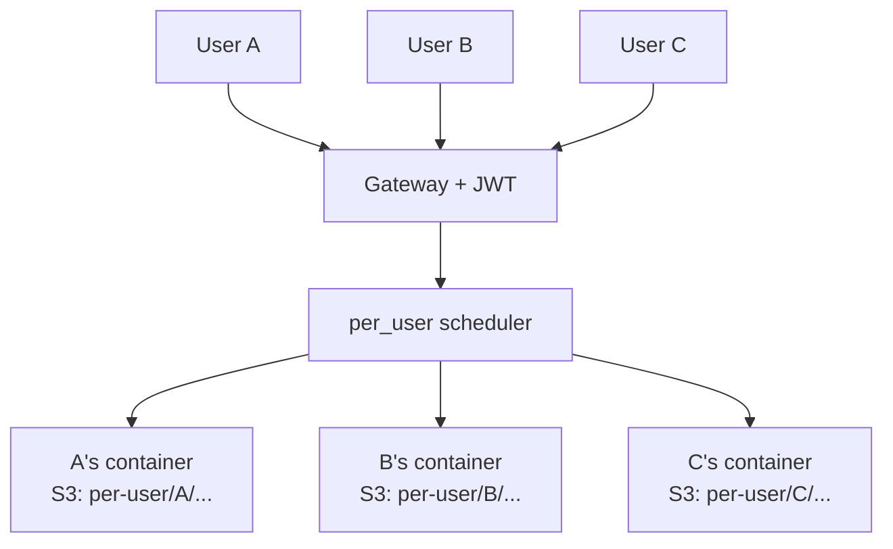
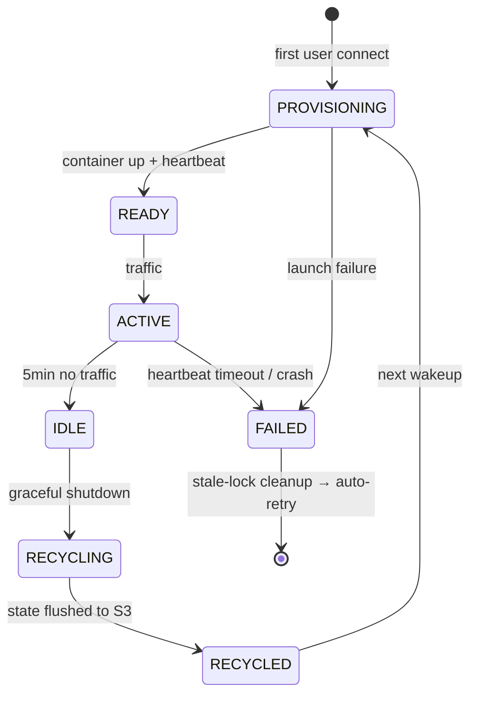

# Deep Dive: How Tego OS v3.0.0's per_user Dedicated Instances Actually Work

> One sentence: a single avatar, safely used by a whole team — without anyone stepping on anyone else.

---

## Why per_user had to happen

In Tego OS v2.x, an "avatar" looked like this:

- One avatar mapped to one container;
- Every user of that avatar connected to the same runtime;
- Conversation history, long-term memory, file workspace — all in that single runtime.

Drop that into a real **front-line, high-concurrency production scenario** — a support center, an IT helpdesk, cross-border e-commerce ops — and three problems show up immediately:

1. **Session bleed.** A is asking about shipping policy, B is chasing a refund — the avatar's context window is squeezed between two unrelated conversations.
2. **Memory contamination.** A "customer preference" stored by A might be overwritten or read by B.
3. **File conflicts.** A's workspace files might get touched by B; nothing is truly per-user.

We received the same customer ask more than once: "Can we give every employee their own runtime?" That's where v3.0.0's `per_user` comes from.

---

## Scheduling model: split the avatar in two

v3.0.0 adds an `instanceMode` field on each avatar:

| Mode | Behavior |
|---|---|
| `shared` (default) | v2-compatible; multiple users share the same runtime |
| `per_user` | Each user gets a dedicated instance container plus a dedicated S3 namespace |

The scheduling diagram:

Four key decisions in the scheduler:

1. **Auth side**: JWT carries `instanceUserId`; every downstream service can identify request ownership.
2. **Routing side**: gateway picks/launches the target container by `(avatarId, instanceUserId)`.
3. **Data side**: S3 read/write paths are rewritten by `instanceUserId`; business code stays unaware.
4. **Reclaim side**: idle past threshold → graceful shutdown → flush state to S3 → sub-second wakeup.

Failure in any of those four steps would make `per_user` feel "untrustworthy," so each step needs its own guardrail (below).

---

## Lifecycle: from PROVISIONING to RECYCLED

The `per_user` container state machine, roughly:

Each state corresponds to clear engineering actions:

- **PROVISIONING → READY** — launch container, mount S3 namespace, pass health check, report heartbeat.
- **READY → ACTIVE** — gateway routes traffic, quota counters start.
- **ACTIVE → IDLE** — 5 minutes of zero traffic by default.
- **IDLE → RECYCLING** — graceful shutdown signal; container has 45s to flush state to S3.
- **RECYCLING → RECYCLED** — orchestrator resources reclaimed (pod / volume / service); S3 data preserved.
- **RECYCLED → PROVISIONING** — next time the user shows up, **sub-second wakeup** reusing S3 data.

Goals: low steady-state footprint, low wakeup latency, recoverable failure.

---

## Three-axis quota guardrails

The biggest risk with `per_user` is resource abuse. When one avatar serves many people, quotas have to be precise to the *person*. v3.0.0 introduces three independent axes:

| Axis | Purpose |
|---|---|
| **Per-avatar cap** | Prevents one avatar from eating a tenant's total resources |
| **Per-user cap** | Prevents an individual from monopolizing |
| **Per-tenant cap** | Prevents a tenant from impacting the cluster |

Any axis hitting its threshold puts requests through the standard queue → retry → reject path.

On top of that, the **capacity guardrail** kicks in once host CPU/memory exceeds 80%: requests are answered with 503 + queued, never crushing the node. This is what makes "instance-as-a-service" production-grade.

---

## Heartbeat fallback and stale-lock cleanup

Container failures are normal — assume they *will* happen:

- process crash;
- network blip;
- node OOM;
- kubelet restart.

Two safety nets in v3.0.0:

### Heartbeat fallback

Containers report a heartbeat every 30s. **No heartbeat for 3 minutes triggers automatic shutdown**, eliminating "zombie container holding quota forever." This means a few users' dead containers can never permanently drain the avatar's quota.

### Stale-lock cleanup

A crash can leave `PROVISIONING` / `PENDING` rows stuck. A **scheduled scanner** flips rows past threshold to `FAILED`, so the next connection auto-retries.

Together, these mean as long as the node itself isn't completely broken, `per_user` will self-heal in reasonable time.

---

## S3 namespace: the data substrate of per_user

For `per_user` to actually work, the S3 path layout can't be a "single shared pot" anymore. v3.0.0 redesigned the namespace:

| Path | Meaning |
|---|---|
| `{avatarId}/{key}` | Template (admin write, all users read-only) |
| `{avatarId}/shared/{key}` | Runtime backup for `shared` mode |
| `{avatarId}/per-user/{userId}/{key}` | Per-user runtime backup for `per_user` mode |

Reads use a **three-layer fallback**:
`runtime/<key>` → `template/<key>` → legacy seed path.

Writes are rewritten by the gateway to `per-user/{userId}/...`; business code doesn't need to know who the user is.

> Customer-facing meaning: when an employee leaves, you only need to wipe `per-user/<userId>/...`. Clean and complete.

---

## One-click reset of all user instances

To keep canary and rollback under control, v3.0.0 ships a "one-click reset of all user instances" operation:

- stop all `per_user` containers;
- delete all orchestrator resources (pod / volume / service);
- clear deployment records;
- clear stale locks;
- optionally preserve or wipe S3 data.

In practice it's used in two situations:

1. **Canary switch** — when an avatar moves from `shared` to `per_user`, clean orchestrator state first.
2. **Architecture upgrades** — when the underlying contract bumps (scheduler, S3 layout), all user containers should be relaunched on the new version.

---

## Warm Pool roadmap

Today's first launch is a 5–15 second cold start. Warm Pool is on the roadmap:

- A scheduler-managed pool of pre-warmed containers;
- On first user connection, bind `instanceUserId` directly out of the pool;
- Target: bring first-launch latency from "5–15s" down to "< 1s."

Warm Pool's design is being co-developed with BusinessMonitor — pool levels will be exposed as new metrics so ops can dynamically size the pool against actual activity.

---

## Engineering takeaway

In retrospect, `per_user` is not a single feature — it's an ensemble:

- **Scheduling** → slice the avatar by user;
- **Data** → S3 namespace prefixing;
- **Quotas** → three independent axes;
- **Stability** → heartbeat fallback + stale-lock cleanup;
- **Recoverability** → one-click reset + three-layer fallback;
- **Evolvability** → Warm Pool ahead.

Only when all of these line up does "one avatar, safely shared by a whole team" stop being a slogan and become a real, deliverable enterprise capability.

---

| Channel | How to reach us |
|---|---|
| Enterprise demo | 30-minute walkthrough of the four core scenarios |
| Private deployment | support@zhama.com |
| Full platform | https://app.zhama.com |
