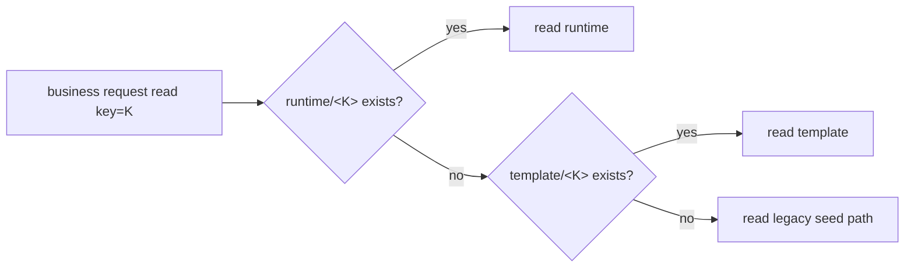
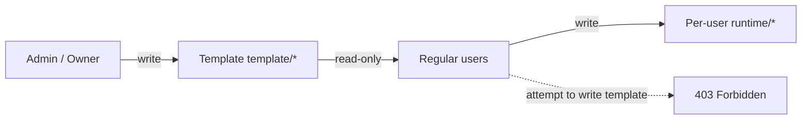

# Three-Layer S3 Isolation + Single-Authority Templates: How Tego OS v3.0.0 Makes the Governance Boundary Explicit

> Templates belong to templates, runtime belongs to users — and the governance boundary is no longer a doc, it's a protocol.

---

## Two old problems from v2

If you've run digital avatars in an enterprise, two pain patterns will feel familiar:

1. **Data slicing too coarse** — everything in S3 lives under `{avatarId}/...`, with templates, shared runtime and every user's runtime mixed together.
2. **Configuration governance out of control** — skills, prompts, templates, workspace configs: anyone with permissions can edit, overwrite, drift across versions, and rollback is hard.

These look like two problems but are really the same one: **there's no clear protocol for "who can write, and where."**

What v3.0.0 does is upgrade that protocol from "rely on documentation and good behavior" to "enforced by S3 paths, the gateway and the JWT."

---

## The new S3 namespace layout

```
{avatarId}/{key}                       ← avatar-level template (admin write, all users read-only)
{avatarId}/shared/{key}                ← runtime backup for shared mode
{avatarId}/per-user/{userId}/{key}     ← per-user runtime backup for per_user mode
```

Why three regions?

| Region | Who writes | When syncs | When cleaned |
|---|---|---|---|
| Template `template/*` | admin / owner (console) | propagates to all replicas on write | rarely (we want history for rollback) |
| `shared` runtime | all users of the avatar | live | when the avatar stops or resets |
| `per-user` runtime | a single user | live | on offboarding or one-click reset |

These three datasets have entirely different lifecycles. Mixing them was guaranteed to break. v3.0.0 separates them physically by prefix — that's the prerequisite for every governance feature that follows.

---

## Three-layer fallback read

Once templates and runtime are split, how does business code read data? The gateway implements a unified **three-layer fallback**:



This fallback gives us:

- **New avatars** — hit template directly;
- **Legacy avatars** — keep working off the old seed path during canary migration;
- **per_user users** — keys not yet in runtime fall through to template, so a new employee starts with "a copy of the latest template."

Business code stays untouched; all rewriting happens at the gateway.

---

## JWT carries instanceUserId

For S3 paths to be rewritten automatically, the gateway needs to know which user a request belongs to. v3.0.0 adds a field to the JWT:

```jsonc
{
  "sub": "u_123",
  "tenant": "tnt_xxx",
  "avatar": "av_yyy",
  "instanceUserId": "u_123",   // ← new field
  "scope": ["chat:read", "chat:write", ...]
}
```

`instanceUserId` is unpacked at the gateway and propagated through every RPC. Any downstream service (S3 gateway, skill scheduler, memory service) can identify ownership.

---

## Single authority for templates and runtime

The permission layer is the largest protocol change in v3.0.0. The new model only allows two kinds of writes:



Four design points:

### 1. Templates can only be edited by admin / owner

…via the console only, and each write automatically bumps three versions:

- `configVersion` — avatar configuration;
- `workspaceVersion` — workspace structure;
- `skillsVersion` — skill set.

Replicas notice the version bump and pull the new template proactively.

### 2. Gateway hard-blocks template writes

A regular-user token attempting to write `template/*` is rejected with 403 at the gateway. This is protocol-level isolation, not "graying out a button" in the UI.

### 3. Dual-write consistency

When the console edits a template, the system first RPC-updates the local replica (operator sees change with no delay), then admin REST writes the S3 template (other replicas converge through heartbeats). Console UX and multi-replica consistency at once.

### 4. Backfill script

For smooth migration of legacy avatars, v3.0.0 ships:

```bash
pnpm db:backfill-template
```

Idempotently migrates legacy seed data to the new template paths. Run it as many times as you want; the result is the same.

---

## One-click reset of all user instances

With three-layer S3 + single authority in place, "reset" finally has clear semantics:

- **Template** — untouched (this is the avatar's "identity");
- **shared runtime** — wiped;
- **per-user runtime** — every user branch wiped, with optional preservation.

v3.0.0 ships this as a single operation: stop containers, delete orchestrator resources, clean volumes, clean deployment records.

---

## What this means for enterprises

### 1. Truly "my data"

When one avatar is shared by a team, each person's session, memory, workspace and media files are truly *theirs* — independently backed up, restored and destroyed.

### 2. Clean offboarding

When someone leaves, just wipe `per-user/<userId>/...`. Audit reports can write out an explicit "data destruction path."

### 3. Governance you can actually explain

"Who can edit templates?" "Who can edit runtime?" "Can I overwrite my colleague's configuration?" Before v3.0.0 these were governed by documentation and trust. Now they're enforced by the protocol.

### 4. DR / compliance per user

Restore one user's workspace? Just `per-user/<userId>/...`.
Export one user's full data? Just `per-user/<userId>/...`.
Audit one user's access? Just `per-user/<userId>/...`.

This is exactly what regulated industries (gov, finance, healthcare) keep asking for.

---

## Engineering takeaway

Three-layer S3 + single authority is the pivot that takes "enterprise digital avatar" from a concept to a system that's **governable, auditable and evolvable**.

It's not a feature people gasp at, but it's the foundation that makes the sexier features (per_user dedicated instances, BusinessMonitor, auto backup-restore, compliance audit) even possible.

---

| Channel | How to reach us |
|---|---|
| Enterprise demo | 30-minute walkthrough of the four core scenarios |
| Private deployment | support@zhama.com |
| Full platform | https://app.zhama.com |
