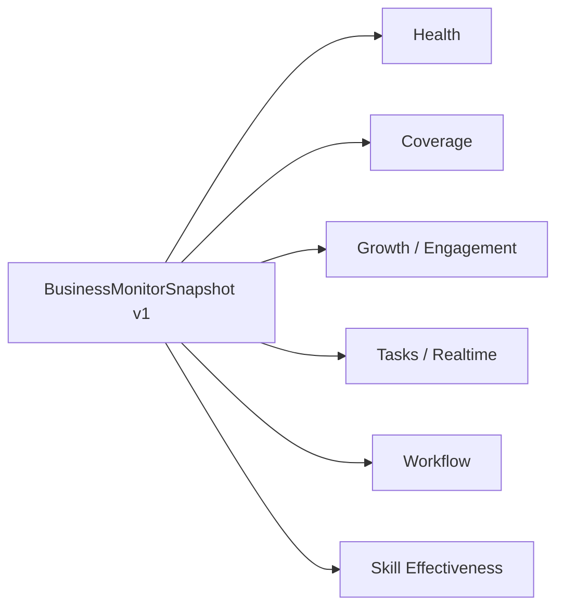

# BusinessMonitor: A Single Screen for the Health and Performance of Your Digital-Avatar Platform

> "How many people are actually using the platform, and how well?" — the most-asked question we heard before v3.0.0.

---

## Why we had to build the dashboard

Once digital avatars are running inside an enterprise, almost every IT director, ops lead and business owner asks the same family of questions:

- **Coverage** — how many users are actually active?
- **Growth** — DAU / WAU / MAU trends? Retention?
- **Engagement** — how often per day, how long per session?
- **Tasks** — what's in the queue right now? Which skills are under pressure?
- **Workflow** — automatic-flow rate? First-call-resolution (FCR)?
- **Skill effectiveness** — which skills are most used, which tools called most?

In the v2.x era these metrics were scattered across audit logs, monolithic analytics warehouses and various spreadsheets. Each pull took manual effort + scripts + 1–3 days. **Without a dashboard there is no business sense.**

v3.0.0's answer is to aggregate every one of those metrics into a single snapshot contract and ship a built-in dashboard.

---

## Core: the BusinessMonitorSnapshot v1 contract

The new `BusinessMonitorService` centers on a single snapshot — `BusinessMonitorSnapshot v1`:

```jsonc
{
  "version": "v1",
  "timestamp": 1745800000000,
  "tenant": "tnt_xxx",
  "health": { ... },        // base health
  "coverage": { ... },      // true active-user denominator
  "growth": { ... },        // growth / engagement
  "tasks": { ... },         // tasks / realtime
  "workflow": { ... },      // workflow (handoff / FCR / flow)
  "skills": { ... }         // skill effectiveness
}
```

One request → one snapshot → render the entire dashboard.

Two implicit benefits:

1. **Simple front-end / back-end contract** — only one payload; the front end doesn't have to compose six APIs.
2. **Natural caching granularity** — an in-process LRU caches the snapshot directly, so high-frequency polling across panels never melts the database.

---

## Six panels



### 1. Health

Audit / channels / health / data sources. At a glance: "Is the platform's heartbeat normal?"

### 2. Coverage

**True active-user denominator**, no estimates. Coverage is what makes "the digital avatar is actually being used by people" measurable.

### 3. Growth / Engagement

DAU / WAU / MAU, retention, activity trends. Sliceable by avatar, tenant, time range.

### 4. Tasks / Realtime

Current task volume and live load — queue depth, processing rate, backlog rate. You don't find out you needed ops attention 24 hours later.

### 5. Workflow

Handoff, FCR, automatic-flow rate, closure rate. The metrics that tell you whether the avatar is actually replacing manual work.

### 6. Skill effectiveness

**Skill matrix + tool-call statistics.** Which skills are used, how often, average success rate, top failure reasons.

---

## Implementation: in-process LRU + 5s TTL

The biggest engineering risk of any dashboard system: front-end polling melts the database. v3.0.0 adds an in-process LRU inside `BusinessMonitorService`:

- Cache key: `(tenant, avatar?, scope, granularity)`;
- Cache value: a complete `BusinessMonitorSnapshot v1`;
- TTL: 5 seconds by default;
- Hit: return immediately;
- Miss: aggregate from data sources and backfill.

This layer is what makes "high-frequency polling across panels won't melt the database" true. A six-panel dashboard polling once per second by a careless front end could fan out to 60 PG queries per second per 10 users. With LRU + 5s TTL, the bulk hits the cache and DB load drops sharply.

---

## Dual deployment: ai-studio + dashboard

v3.0.0 ships dedicated routes on both ends:

- `_authenticated/admin_.business-monitor` (ai-studio) — for ops staff;
- `_authenticated/admin_.business-monitor` (dashboard) — for tenant admins.

Both share the same `BusinessMonitorSnapshot v1` contract; presentation and permissions differ slightly:

- **ai-studio** — drill into specific avatars at fine granularity;
- **dashboard** — focus on tenant overview, drill down to avatars.

---

## Six new analytical views

The backend simultaneously ships six new postgres views, giving each panel a clean materialization path:

- `coverage_view`
- `growth_view`
- `engagement_view`
- `tasks_view`
- `workflow_view`
- `skills_view`

Views handle base joins and pre-aggregation; the service layer handles final composition and caching. This separation means SQL changes don't break the service contract, and presentation changes don't require touching SQL every time.

---

## Customer value

### 1. IT director — "Can I justify it this week?"

A week after the IT-assistant avatar goes live, BusinessMonitor immediately tells the director:

- True active users (not "registrations");
- Ticket FCR;
- SLA trend;
- Whether the avatar's resource use is within thresholds.

### 2. Ops director — "Did the avatar contribute to the business?"

A month after the e-commerce-ops avatar goes live, the ops director sees:

- Activity per store;
- Frequency of high-value skills like `listing-forge`;
- Stores not yet onboarded (training opportunity);
- Load differences across multi-market avatars.

### 3. CTO / Architect — "Is the platform running under healthy load?"

Skill-effectiveness + tasks/realtime panels show the architect:

- Most-called skills;
- Most-failed tool calls;
- Current backlog;
- Whether to scale.

---

## Engineering takeaway

BusinessMonitor isn't an isolated "shiny dashboard" — it's the final piece that takes "enterprise digital avatar" from "it runs" to "governable, auditable, evolvable":

- **per_user** lets the avatar enter production;
- **3-layer S3 + single authority** lets the platform be governed;
- **BusinessMonitor** lets leaders see clearly.

Only when all three line up do enterprises have the confidence to put AI into core business processes.

---

| Channel | How to reach us |
|---|---|
| Enterprise demo | 30-minute walkthrough of the four core scenarios |
| Private deployment | support@zhama.com |
| Full platform | https://app.zhama.com |
