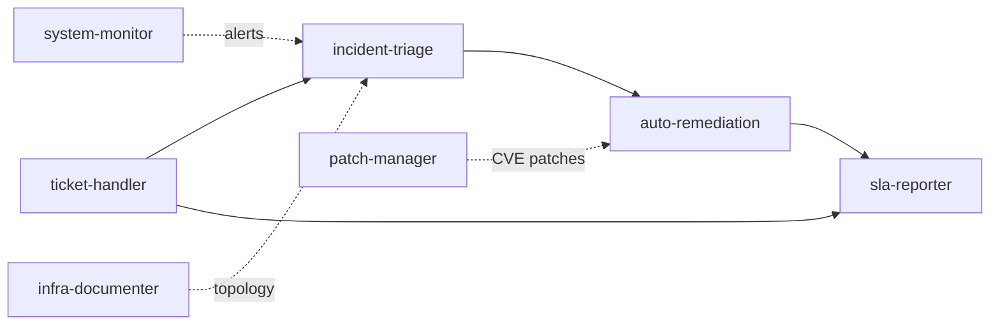
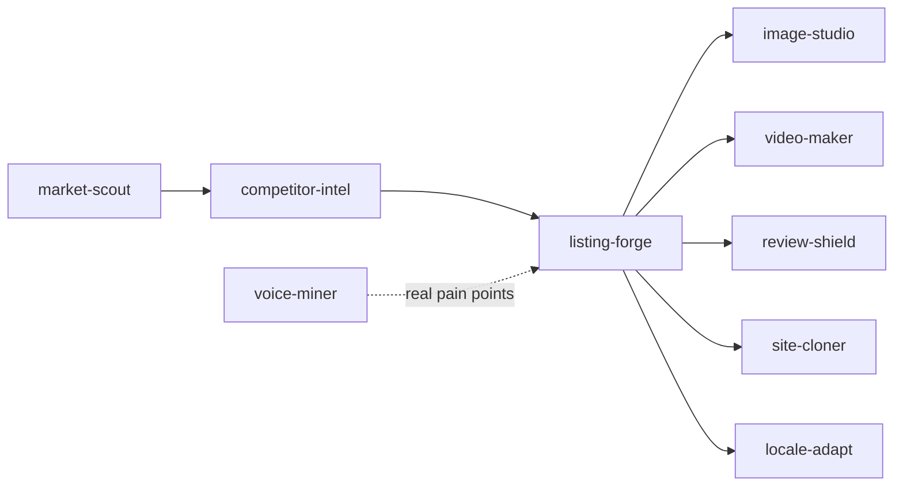

# 16 Out-of-the-Box Tego Template Skills: IT Ops + Cross-Border E-commerce, Productive Day One

> For a digital avatar to "do work right away," the bottleneck has never been the model — it's the absence of a ready-made skill library.

---

## Why "16 out-of-the-box skills"

Over the past year we've heard the same family of questions from many customers:

- "What can a Tego digital avatar actually do?"
- "How long would it take us to build a skill library from scratch?"
- "Can you give us a working starting kit?"

The real bottleneck of digital avatars is never model capability; it's:

1. **Mapping scenario → skills requires domain expertise** — workflows differ wildly across industries, hard to abstract into universal skills;
2. **Executable scripts have to actually run** — "prompt templates" don't count; skills must include tool calls, state machines and rollback;
3. **Skills must integrate with the avatar's runtime** — they need access to memory, MCP, and metric reporting into BusinessMonitor.

v3.0.0 answers all of that at once: **16 Tego template skills** across two of the highest-frequency industry chains: **IT operations** and **cross-border e-commerce**.

---

## IT operations: 11 skills, end-to-end loop

### 1. `ticket-handler` — full ticket lifecycle

Intake, classification, priority, routing, SLA tracking. Difference vs. classic ticketing: the avatar can decide priority *based on context*, route to the right expert group (or self-heal skill) automatically, and trigger SLA accounting.

### 2. `incident-triage` — fast diagnosis

Log analysis, metric correlation, runbook matching. Combined with `system-monitor` alerts, it can produce "most likely root cause + recommended runbook" within 30 seconds.

### 3. `auto-remediation` — automatic fixes

Service restart, disk cleanup, cache flush — with dry-run. All fixes default to dry-run output for admin approval; high-frequency low-risk actions can be configured for auto-execution.

### 4. `system-monitor` — proactive health monitoring

Connectivity, resources, alert tiers. Pulls scattered zabbix / prometheus / cloud-monitor metrics into the avatar's working memory so it has a "global view."

### 5. `infra-documenter` — automated infrastructure docs

Discovery, inventory, topology, change tracking. Turns "docs lag reality by 6 months" into "docs update themselves daily."

### 6. `patch-manager` — vulnerability & patch lifecycle

CVE matching, risk assessment, rollback plan. The avatar identifies "this machine needs this patch" and generates the rollback plan.

### 7. `sla-reporter` — SLA compliance reporting

Availability, MTTR, trend analysis. Combined with BusinessMonitor's workflow panel, exports an SLA monthly report in one click.

### 8–11. Supporting engineering skills

Including but not limited to change review, release gating, capacity planning, and security audit assistants.

> An IT-assistant avatar can run end-to-end: intake → triage → routing → self-healing → SLA reporting. No need to build from scratch.

---

## Cross-border e-commerce: 5+ skills, full loop

### 1. `market-scout` — market research

Cross-validates Amazon Best Sellers / Google Trends / TikTok to distinguish "real heat" from "short-term spike."

### 2. `competitor-intel` — competitor analysis

Scrape & analyze reviews, identify weaknesses, generate attack strategies. Compresses a week of traditional ops research into 30 minutes.

### 3. `listing-forge` — listing copywriting

Pulls competitor weaknesses from the avatar's memory and writes SEO-optimized listings. **Key difference**: not "fill in a template" — the avatar remembers the store's, category's and market's history.

### 4. `image-studio` — hero / scene images

White-background, compliance-checked, AI-generated.

### 5. `video-maker` — 15-second UGC short videos

Optimized for TikTok / Reels.

### 6. `voice-miner` — user pain-point mining

Reddit / forum mining for real user pain points; feeds back into listings and product iteration.

### 7. `review-shield` — negative-review classification & compliant replies

Classification + auto-reply + escalation. The ops director sets compliance bounds (e.g., "no refund promises"), the avatar answers within them.

### 8. `site-cloner` — competitor landing-page structure cloning

Extracts structure (not content) from competitor pages into reusable skeletons.

### 9. `locale-adapt` — multi-market localization

Cultural adaptation, local keywords, market-specific SEO. Combined with `per_user`, every store and every market has its own runtime context — memories don't leak.

> A cross-border e-commerce avatar can run product discovery → competitor intel → listing → hero image / video → negative-review handling → multi-market localization end-to-end.

---

## Integration with the rest of v3.0.0

These 16 skills are not stacked independently — they **deeply depend** on v3.0.0's underlying capabilities:

### With `per_user`

- IT ops: every IT colleague using the "IT assistant" avatar has their own runtime — ticket context, runbook preferences, change records;
- Cross-border ops: every store account has its own runtime in the "ops" avatar — competitor intel, brand glossary, listing history don't leak.

### With 3-layer S3 + single authority

- The skills themselves (`SKILL.md`, `scripts/`, configs) live under `template/*`, governed centrally;
- User-generated workspace data (drafts, generated images, scratch tables) lives under `per-user/<userId>/...`;
- Upgrading a skill only updates the template; all user instances pull on next launch with no conflicts.

### With BusinessMonitor

- **Skill effectiveness panel** shows call frequency, average success rate, top failure reasons for all 16;
- **Workflow panel** shows FCR and auto-flow rates for the `ticket-handler → incident-triage → auto-remediation` chain;
- **Tasks panel** shows live load on heavier skills like `auto-remediation` / `image-studio`.

---

## Recommended rollout cadence

If you're just putting an avatar into production, we recommend:

1. **Week 1** — 1 avatar, 1 skill, 5 users (small canary);
2. **Week 2** — 3–5 skills, 20 users, enable `per_user`;
3. **Week 3** — wire up BusinessMonitor; let IT / ops leads start watching numbers;
4. **Week 4** — let BusinessMonitor's skill-effectiveness panel decide which skills to add next.

Don't install all 16 on day one. **Avatar runs in real business → produces data → produces feedback → install new skills** is the fastest path.

---

## Engineering takeaway

"16 out-of-the-box skills" looks like a number; underneath it's v3.0.0's delivery-side promise:

- **No more 2–3 months building skills from scratch**;
- **Every skill has executable scripts** that can call tools, write files, hit APIs;
- **Every skill integrates with per_user / template governance / BusinessMonitor** and can drop into real business flows;
- **The skill library will keep expanding** — customers are welcome to contribute back industry know-how as new templates.

The skill library is the most critical step in moving digital avatars from "they can chat" to "they can do work."

---

| Channel | How to reach us |
|---|---|
| Enterprise demo | 30-minute walkthrough of the four core scenarios |
| Industry consultation | support@zhama.com |
| Full platform | https://app.zhama.com |
