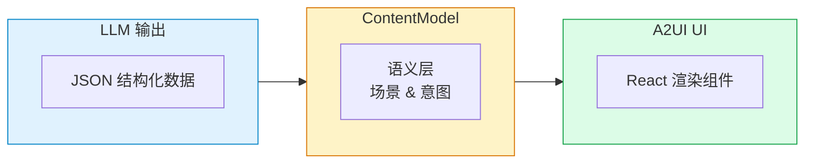

# 领先 Google 官方发布！我们开源了首个 A2UI React 完整实现

> 当 AI 不再只是输出文字，而是直接「画」出界面

---

## 什么是 A2UI？

**2025 年 12 月**，Google 正式发布了一项革命性的开源协议 —— **A2UI（Agent-to-User Interface）**，即「智能体到用户界面」协议。

这是什么意思？

想象一下：当你和 AI 对话时，AI 不再只是返回一段文字，而是直接返回一个**完整的交互式界面**——有按钮、有卡片、有表单、有图表。用户可以直接点击、填写、交互，而不是复制粘贴一大段文字。

**这就是 A2UI 协议要解决的问题。**

---

## 为什么 A2UI 如此重要？

### 传统 AI 交互的痛点

> **用户**：帮我生成一份报告
> 
> **AI**：好的，以下是报告内容... *[一大段纯文本]* ...如需修改请告诉我

用户需要：
- 复制粘贴文本
- 自己排版格式化
- 再次对话反复修改

### A2UI 时代的交互

> **用户**：帮我生成一份报告
> 
> **AI**：*[直接渲染出报告界面]*
> - 包含图表
> - 可编辑的表格
> - 一键导出按钮
> - 实时修改反馈

**这不是概念，这是现实。**

---

## 我们做了什么？率先实现 React 版本

根据 Google 的官方路线图：

| 时间节点 | 里程碑 |
| --- | --- |
| 2025.12 | A2UI 协议发布 (v0.8 公开预览版) |
| **2026 Q1** | **官方 React 渲染器发布** |
| 2026 Q2 | SwiftUI / Jetpack Compose 渲染器 |
| 2026 Q4 | v1.0 稳定版发布 |

**然而，我们等不及了。**

Zhama AI 团队基于 A2UI 协议规范，**在官方 React 渲染器发布之前**，率先开源了首个完整的 React 实现：

**[@zhama/a2ui](https://github.com/zhama-ai/a2ui-react)**

---

## @zhama/a2ui 核心特性

### AI 优先设计

专为 AI 智能体动态生成 UI 而设计，不是让开发者手写组件，而是让 AI 输出结构化数据自动渲染。

### 完整协议支持

100% 实现 A2UI 协议规范，包括：
- 所有标准组件类型
- 数据绑定与路径引用
- 事件处理与动作系统
- Surface 管理

### 独立样式系统

- **零依赖 Tailwind** — 自带完整 CSS 工具类
- **`a2-` 前缀** — 避免与宿主应用冲突
- **自动暗色模式** — 使用 CSS `light-dark()` 函数
- **OKLCH 色彩空间** — 现代色彩系统

### 安全优先

采用声明式数据格式，而非可执行代码：
- AI 只能使用预定义组件
- 没有代码注入风险
- 完全可控的 UI 渲染

### 丰富组件库

| 组件 | 用途 |
| --- | --- |
| **Text** | 支持 Markdown 的文本渲染 |
| **Button** | 带动作的交互按钮 |
| **Card** | 内容卡片容器 |
| **List** | 垂直/水平列表 |
| **TextField** | 文本输入框 |
| **Checkbox** | 复选框 |
| **Tabs** | 选项卡切换 |
| **Modal** | 模态对话框 |
| **Chart** | 数据图表 |
| **Image/Video/Audio** | 多媒体组件 |

### 高性能

- 遵循 React 最佳实践
- 优化的重渲染策略
- 支持流式渲染

### 完整 TypeScript 支持

- 全面的类型定义
- 智能代码补全
- 编译时错误检查

---

## 看看实际效果

### 场景一：AI 培训助手

用户输入 `hello`，AI 直接生成带主题卡片的欢迎界面：

> **欢迎来到 AI 培训系统**
> 
> 包含课程卡片（React 入门、Python 进阶）、开始学习按钮、实时学习进度条显示 80%

### 场景二：交互式表单

AI 需要收集用户信息时，直接生成表单：

> **请填写以下信息**
> 
> 包含姓名输入框、邮箱输入框、订阅复选框、取消/确认提交按钮

### 场景三：数据可视化

AI 分析数据后，直接展示图表：

> **销售数据分析**
> 
> 包含月度趋势柱状图、类别分布饼图、AI 洞察提示「3月销量环比增长 25%」

---

## 5 分钟快速开始

### 安装

```bash
npm install @zhama/a2ui
# 或
pnpm add @zhama/a2ui
```

### 基础使用

```tsx
import { StyleProvider, ThemeProvider, A2UIRoot } from '@zhama/a2ui';

function App() {
  // AI 输出的组件结构
  const components = [
    {
      id: 'welcome',
      type: 'Card',
      properties: {
        child: {
          id: 'content',
          type: 'Column',
          properties: {
            children: [
              {
                id: 'title',
                type: 'Text',
                properties: {
                  text: { literal: '欢迎使用 A2UI!' },
                  usageHint: { literal: 'h1' }
                }
              },
              {
                id: 'action',
                type: 'Button',
                properties: {
                  child: {
                    id: 'btn-text',
                    type: 'Text',
                    properties: { text: { literal: '开始体验' } }
                  },
                  action: { type: 'postback', payload: 'start' }
                }
              }
            ]
          }
        }
      }
    }
  ];

  return (
    <StyleProvider>
      <ThemeProvider>
        <A2UIRoot 
          childComponents={components}
          onAction={(e) => console.log('用户点击:', e)}
        />
      </ThemeProvider>
    </StyleProvider>
  );
}
```

### 运行 Demo

```bash
# 克隆仓库
git clone https://github.com/zhama-ai/a2ui-react.git
cd a2ui-react

# 运行示例
cd examples/basic-demo
npm install
npm run dev
```

打开 http://localhost:5174 体验完整 Demo！

---

## 应用场景

### AI 教育培训

- 动态生成课程内容
- 交互式测验和评估
- 个性化学习路径
- 实时进度追踪

### 智能客服

- 表单式信息收集
- 产品卡片推荐
- 多步骤引导流程
- 可视化数据展示

### 商业智能

- AI 驱动的报告生成
- 动态仪表板
- 审批工作流
- 数据录入表单

### 开发者工具

- 交互式文档
- 配置向导
- 调试界面
- 代码生成预览

---

## 架构设计

A2UI 采用两层架构，让 AI 专注内容，框架专注渲染：



**核心优势：**
- **关注点分离** — LLM 不需要关心 UI 细节
- **灵活性** — 更换渲染框架无需改 Prompt
- **安全性** — 声明式数据，无代码执行
- **可测试** — 内容逻辑与 UI 独立测试

---

## 为什么选择 @zhama/a2ui？

| 特性 | @zhama/a2ui | 等待官方 |
| --- | --- | --- |
| 可用时间 | **现在** | 2026 Q1 |
| React 18 支持 | 支持 | - |
| 完整组件库 | 15+ 组件 | - |
| TypeScript | 100% | - |
| 独立样式系统 | 支持 | - |
| 中文文档 | 支持 | - |
| 开源协议 | MIT | - |
| 生产可用 | 支持 | - |

---

## 参与贡献

我们欢迎社区参与！无论是：
- 提交 Issue
- 功能建议
- 完善文档
- 提交 PR

都非常欢迎！

**GitHub 仓库：** https://github.com/zhama-ai/a2ui-react

---

## 资源链接

- **NPM 包**: [@zhama/a2ui](https://www.npmjs.com/package/@zhama/a2ui)
- **完整文档**: [GitHub README](https://github.com/zhama-ai/a2ui-react)
- **在线 Demo**: [examples/basic-demo](https://github.com/zhama-ai/a2ui-react/tree/main/examples/basic-demo)
- **A2UI 官方协议**: [a2ui.org](https://a2ui.org)
- **Google 发布博客**: [developers.googleblog.com](https://developers.googleblog.com/introducing-a2ui-an-open-project-for-agent-driven-interfaces/)

---

## 未来展望

A2UI 代表了 AI 交互的未来方向。随着协议的成熟，我们将持续：

- 跟进 A2UI 协议版本更新
- 扩展更多组件类型
- 提供更多主题选项
- 优化移动端体验
- 增加插件扩展能力

---

## 最后

**AI 时代已经到来，但 AI 的表达方式还在进化。**

从纯文本 → Markdown → 结构化数据 → **动态交互界面**

A2UI 让 AI 不再只是「说」，而是真正地「做」。

**现在就开始使用 @zhama/a2ui，让你的 AI 应用拥有真正的交互能力！**

```bash
npm install @zhama/a2ui
```

---

**如果觉得有帮助，请给我们 Star！**

[GitHub](https://github.com/zhama-ai/a2ui-react) | [NPM](https://www.npmjs.com/package/@zhama/a2ui) | [文档](https://github.com/zhama-ai/a2ui-react#readme)

Made with love by [Zhama AI](https://zhama.com)

---

*本文首发于 Zhama AI 公众号，转载请注明出处。*

---

## 附录：常见问题

### Q: A2UI 和普通 React 组件有什么区别？

A2UI 组件专为 AI 动态生成设计。AI 输出的是结构化数据（JSON），而非代码。这意味着：
- 更安全（无代码注入风险）
- 更灵活（数据驱动，易于修改）
- 更适合 AI（LLM 擅长生成结构化数据）

### Q: 可以不用 AI 直接使用 A2UI 吗？

可以！虽然 A2UI 专为 AI 设计，但你完全可以手动构建 ComponentNode 结构。只是比传统 React 开发更繁琐。

### Q: 支持哪些 LLM？

任何能输出 JSON 的 LLM 都可以：
- GPT-4 / GPT-3.5 (OpenAI)
- Claude 3 (Anthropic)
- Gemini Pro (Google)
- 各类开源模型

### Q: 如何自定义样式？

A2UI 提供多种自定义方式：
1. 通过 `ThemeProvider` 的 `theme` 属性覆盖组件样式
2. 直接覆盖 CSS 变量
3. 添加自定义 CSS 类

### Q: 生产环境可用吗？

是的！@zhama/a2ui 已在多个生产应用中使用，稳定可靠。我们遵循语义化版本控制，确保升级平滑。
