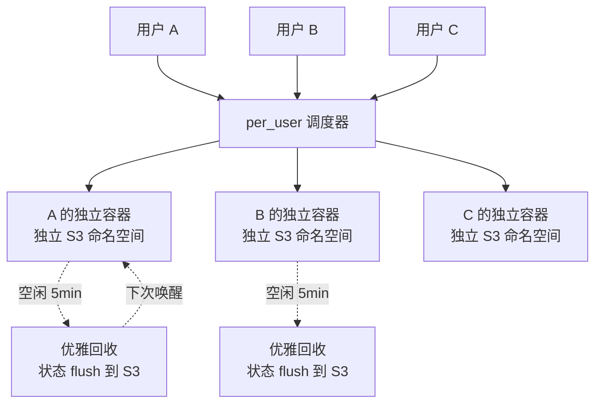
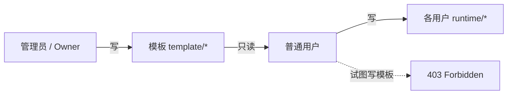

# Tego OS v3.0.0 正式发布：让一个数字分身真正能被一群人一起用

> 同一个数字分身，可以让一群人放心地、互不打扰地一起用。

---

## 这一版到底升级了什么

如果用一句话总结 Tego OS v3.0.0，那就是：

> **「同一个数字分身，可以让一群人放心地、互不打扰地一起用。」**

过去一年，Tego OS 在 v2.x 系列里把「企业数字分身」这件事跑通了：分身可以被创建、被运行、被接入企业微信/钉钉/飞书/Slack，可以挂载技能、可以接外部数据源。但要真正把分身放进一线生产业务——客服中心、IT 工单、跨境电商运营——会立刻撞到几个老问题：

1. **多人并发会串扰**。多个用户共享同一份运行时，会话、记忆、文件相互覆盖。
2. **数据切片太粗**。S3 「大锅饭」式存放，恢复 / 销毁很难按用户切片。
3. **谁都能改配置**。模板、技能、提示词谁都能写，互相覆盖、版本失控。
4. **运营心里没底**。多少人真正在用、参与度如何、技能效能如何，全靠人工拉取。

v3.0.0 不是又加了几个 Feature，而是**针对这四个问题做了一次全栈级别的重写**：

- **架构层**：引入 `per_user` 独享实例 —— 同一分身按用户拉起独立容器；
- **数据层**：S3 命名空间分三层 —— 模板 / shared / per-user 严格分离；
- **治理层**：模板 / 运行时单一权威 —— 普通用户的写模板请求一律 403；
- **观测层**：全新 BusinessMonitor 大屏 —— 平台健康度、覆盖、增长、参与、工作流、技能效能一屏看清；
- **体验层**：Mini Chat 浮窗 + 下载中心 + Windows NSIS 安装器全面重写；
- **生态层**：16 个开箱即用的 Tego 模板技能（IT 运维 11 个 + 跨境电商 5+ 个）。

把「能跑的产品」升级为「可对企业、对组织、对生产业务真正交付的系统」，这就是 v3.0.0 的目标。

---

## 四个分水岭：v2.x → v3.0.0

| 维度 | v2.x（之前） | v3.0.0（现在） |
|---|---|---|
| **多人并发** | 多用户共享一份运行时，会话/记忆易串扰 | 独享实例 `per_user`，每个用户一份独立运行环境 |
| **数据隔离** | S3 大锅饭，恢复/销毁难以按用户切片 | 模板与运行时分前缀，可按用户独立备份 / 恢复 / 销毁 |
| **配置治理** | 谁都能改、改完容易冲突 | 模板单一权威，普通用户写模板路径强制 403 |
| **运营观测** | 指标散落在多个分析仓 | BusinessMonitor 大屏一屏看清覆盖、增长、参与、工作流、技能效能 |

这四件事是一个整体——单独哪一件都不能让分身跑进生产，必须一起解决。

---

## 核心能力一：`per_user` 独享实例

### 痛点

v2 时代，一个分身对应一个容器、所有用户共享同一份运行时状态。客服、IT 工单这类「同时几十人用同一个分身」的场景，会话/记忆/工作区互相覆盖，很难真正放到一线生产用。

### v3.0.0 的解法

v3.0.0 在分身上加了一个 `instanceMode` 字段：

- `shared`（默认）：保持 v2 兼容，多用户共享一份运行时；
- `per_user`：每个用户拉起独立的实例容器 + 独立 S3 命名空间。

### 六个关键护栏

1. **每用户独立容器**：用户首次连接时拉起专属实例，绑定专属 S3 命名空间。
2. **空闲自动回收**：默认 5 分钟无活跃即触发优雅停机，给容器 45 秒把状态 flush 到 S3，下次秒级唤醒。
3. **三维配额护栏**：每分身、每用户、每租户都有独立上限，杜绝越权占用。
4. **资源容量护栏**：宿主 CPU / 内存超过 80% 直接 503 + 排队，避免压垮节点。
5. **心跳超时兜底**：3 分钟无心跳自动停机，杜绝「容器僵死 + 配额永久占用」。
6. **Stale 锁自动清理**：进程崩溃导致的 `PROVISIONING` / `PENDING` 卡死会被定时器扫描置 `FAILED`，下次自动重试。

> Warm Pool 设计已纳入下一阶段路线图，目标是把首次启动从「5–15 秒冷启」压到「<1 秒」。

---

## 核心能力二：S3 三层数据隔离

`per_user` 真正能跑，前提是底层的备份 / 恢复路径不能再「大锅饭」。v3.0.0 重新设计了 S3 命名空间：

| 路径 | 含义 |
|---|---|
| `{avatarId}/{key}` | 分身级模板（admin 可写，所有用户只读） |
| `{avatarId}/shared/{key}` | shared 模式的运行时备份 |
| `{avatarId}/per-user/{userId}/{key}` | per_user 模式下每个用户的独立备份 |

并配套四项关键工程：

1. **JWT 携带 instanceUserId**：全链路透明传递，识别每个请求归属哪个用户实例。
2. **网关自动改写读写路径**：按 `instanceUserId` 重写 S3 路径，业务代码无感。
3. **三层 fallback 读取**：`runtime/<key>` → `template/<key>` → 老 seed 路径，新老用户平滑过渡。
4. **一键重置全部用户实例**：停容器、删编排资源、清 volume、清 deployment 记录，干净彻底。

> 对客户的意义：同一个分身被一群用户用起来，每个人的会话、记忆、工作区、媒体文件，都是真正「我的」，可独立备份、独立恢复、独立销毁。

---

## 核心能力三：模板 / 运行时单一权威

四项关键设计：

1. **模板路径只能由 admin / owner 通过控制台改**：写入会自动 bump 对应版本号（`configVersion` / `workspaceVersion` / `skillsVersion`）；
2. **网关写侧强制拦截**：普通用户的 token 一旦试图写模板路径，直接 403；
3. **双写一致性**：先 RPC 改本地副本、再 admin REST 写 S3 模板，操作员无延迟可见，其他副本通过心跳最终一致；
4. **回填脚本**：`pnpm db:backfill-template` 幂等地把老分身 seed 数据迁到新模板路径。

治理边界从「靠规范、靠口头约定」变成「靠协议层硬隔离」。

---

## 核心能力四：BusinessMonitor 业务运营大屏

新版 `BusinessMonitorService` 把原本散落在审计、分析仓中的指标，一次性聚合为可直接展示的 `BusinessMonitorSnapshot v1` 契约。**六个面板**：

- **基础健康**：审计 / 渠道 / 健康 / 数据源；
- **覆盖率（Coverage）**：真实活跃用户分母，不再依赖估算；
- **增长 / 参与（Growth / Engagement）**：DAU / WAU / MAU、留存与活跃趋势；
- **任务 / 实时（Tasks / Realtime）**：当前任务量与实时负载；
- **工作流（Workflow）**：Handoff、FCR（一次解决率）、自动流转率、关闭率；
- **技能效能（Skill Effectiveness）**：技能矩阵 + 工具调用统计。

工程要点：

- **进程内 LRU**（5 秒 TTL）缓存，多面板高频轮询不会反向打挂数据库；
- **ai-studio 与 dashboard 双端**均上线了独立路由 `_authenticated/admin_.business-monitor`；
- 同时随版本下发 6 个新分析视图：覆盖、增长、参与、任务、工作流、技能。

「业务大屏」不再是营销话术，而是平台自带的能力。

---

## 16 个开箱即用的 Tego 模板技能

数字分身要「立刻能干活」，最大的门槛从来不是模型，而是没有现成的技能库。v3.0.0 一次性补齐了 **16 个 Tego 系列模板技能**，覆盖两条最高频的产业链路：

### IT 运维（11 个）

`ticket-handler`、`incident-triage`、`auto-remediation`、`system-monitor`、`infra-documenter`、`patch-manager`、`sla-reporter` 以及配套的脚本能力。一个 IT 工单分身从「受理 → 分类 → 路由 → 自愈 → SLA 报表」可以完全跑通。

### 跨境电商（5+ 个）

`market-scout`、`competitor-intel`、`listing-forge`、`image-studio`、`video-maker`、`voice-miner`、`review-shield`、`site-cloner`、`locale-adapt`。一个跨境电商分身从「选品 → 竞调 → Listing → 主图 / 视频 → 差评回复 → 多市场本地化」全链路可执行。

> 所有技能都附带可执行脚本（bash），不是「提示词模板」，而是真的能跑。

---

## 桌面端体验三连击

### Mini Chat：常驻置顶的「随手分身」

- 独立的 Tauri 窗口，紧凑、无边框、可置顶；
- 与主窗口共享同一会话，对话不分裂；
- 全局快捷键，参考 Spotlight / Raycast 行为唤出 / 隐藏；
- 跨窗口同步，两个窗口始终展示同一会话；
- 懒创建 + 复用，第一次呼出才创建 webview，避免重复加载。

### Downloads：统一的下载中心

桌面端、移动端、命令行的安装包统一入口，企业用户首次拿到环境后能快速分发到不同终端。

### Windows NSIS 安装器全面重写

修复 v2.x 在公司内网常见的安装失败问题，新增静默安装、自动卸载旧版、安装包瘦身、签名兼容性提升。

---

## 三大落地场景

v3.0.0 的核心能力对应着三个我们已经跑通的真实场景：

### 场景一：IT 内部支持

- 共用「IT 助理」分身 + `per_user` 独享实例 → 几十名同事同时用、互不串扰；
- 11 个 IT 运维技能开箱可用 → 工单可被自动受理 / 自愈 / 出 SLA 报表；
- BusinessMonitor 大屏 → IT 主管一屏看清「真活跃用户、覆盖率、首次解决率、SLA 趋势」。

### 场景二：跨境电商运营

- 共用「电商运营」分身 + `per_user` → 不同国家 / 店铺各跑各的，记忆互不串扰；
- 5+ 跨境技能开箱 → 选品、竞调、Listing、视频、差评回复、本地化；
- 模板治理 → 品牌词库、SOP 模板由运营总监统一更新，店铺号无法改坏。

### 场景三：受监管的敏感场景（政务、金融、医疗）

- `per_user` + S3 三层 → 每个员工的会话 / 记忆物理上落在独立路径，便于离职销毁；
- 单一权威 → 模板版本受控、可审计；
- 私有化部署 → 数据驻留在企业内网；
- 桌面端 Mini Chat → 在合规终端上提供「不离屏」的轻量入口。

---

## 性能与体量（v3.0.0 实测）

| 指标 | 提升 |
|---|---|
| 镜像构建 | 拆分编译 / 打包两阶段，CI 缓存命中率显著上升 |
| 基础镜像 | 通过 dockerfile 精简，整体减小 |
| 大屏接口 | 进程内 LRU + 5 秒 TTL，DB 压力大幅下降 |
| `per_user` 内存占用 | 通过 5 分钟空闲回收 + 心跳兜底，稳态占用可控 |
| 长会话稳定性 | 引入 stale 锁清理 + 三维配额，长跑无僵死 |
| 包管理 | 全面切到 pnpm workspace，安装与 CI 时长下降 |

---

## 升级与迁移

推荐路径：

1. **先升 server**，再升 desktop / mini，确认契约 v1 可读；
2. **执行回填脚本**：`pnpm db:backfill-template` 把老分身 seed 数据迁到新模板路径；
3. **挑选典型分身打开 `per_user`**，先做小范围灰度；
4. **接入 BusinessMonitor 大屏**，确认覆盖、增长、参与、工作流四组指标可读；
5. **桌面端推 v3 安装包**，体验 Mini Chat 浮窗与统一下载中心。

需要特别关注的破坏性变更：

- 普通用户 token 写模板路径将被 403 拦截，需配套迁移控制台权限；
- 新 S3 命名空间引入后，旧的直接 `{avatarId}/{key}` 写入路径不再适用；
- `instanceMode` 缺省仍为 `shared`，但建议生产域逐步切换到 `per_user`；
- BusinessMonitor 契约为 v1，后续会持续演进，建议消费方按字段消费；
- Windows 安装器升级后将自动卸载旧版本，请提示终端用户保留必要数据；
- pnpm workspace 替代旧脚本的部分 npm 命令，CI 配置需同步调整。

---

## 私有化交付

Tego OS v3.0.0 同时支持三种交付形态：

- **纯私有化**：全部组件部署在客户内网，数据不出企业边界；
- **混合云**：核心数据在客户内网，模型 / 推理可以走云；
- **SaaS**：扎马运营的 SaaS 环境，开箱即用。

并提供六项私有化能力：部署形态、数据驻留、认证集成、审计与合规、国产化兼容、离线升级。

---

## 写在最后

v3.0.0 是 Tego OS 历史上最大的一次重写。我们想做的不是「再加一个炫酷的功能」，而是**让一个数字分身真正能被一群人放心地、互不打扰地一起用**——这件事过去一直没有人系统地解掉。

如果你正在为这些问题发愁：

- 同一个分身放进客服 / IT / 电商一线，怎么避免几十人之间的会话串扰？
- 数据如何按用户独立备份与销毁？
- 模板和提示词怎么治理才不会被改乱？
- 平台到底有多少人在用、用得怎么样？

那 v3.0.0 就是为你准备的。

---

| 渠道 | 方式 |
|------|------|
| 申请企业版演示 | 30 分钟看完 4 个核心场景 |
| 私有化部署咨询 | support@zhama.com |
| 完整平台 | https://app.zhama.com |
| 下载中心 | https://zhama.com/zh/download |

**让一个数字分身真正能被一群人一起用——这就是 Tego OS v3.0.0。**
