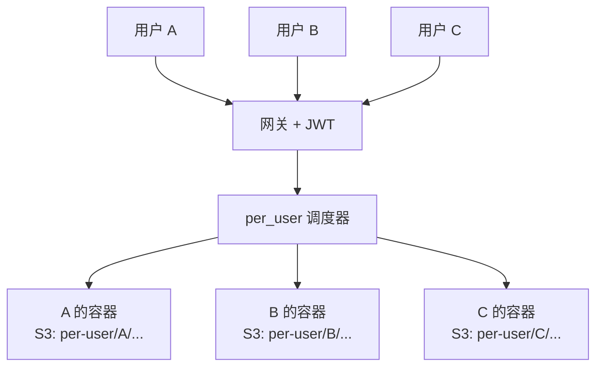
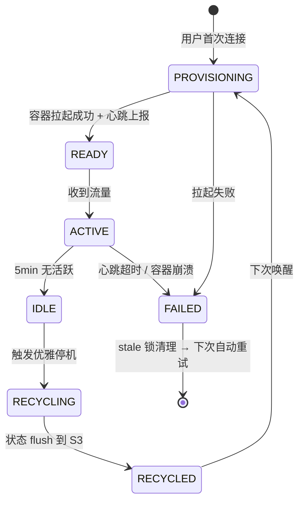

# 深度解析：Tego OS v3.0.0 的 per_user 独享实例是怎么落地的

> 一句话：让一个分身能被一群人放心地、互不打扰地一起用。

---

## 为什么必须做 per_user

在 Tego OS v2.x 里，「分身」是这样的：

- 一个分身对应一个容器；
- 该分身的所有用户，都连到同一份运行时；
- 会话历史、长期记忆、文件工作区等，都在那一份运行时里。

只要把分身放进**一线高并发的生产场景**——客服中心、IT 工单、跨境电商运营——立刻会出现三类问题：

1. **会话串扰**：A 在问发货政策，B 在追退款进度，分身的上下文窗口被两类对话挤压；
2. **记忆污染**：A 给分身存的「客户偏好」可能被 B 的会话覆盖或读到；
3. **文件冲突**：A 的工作区文件可能被 B 操作，无法真正按用户切片。

我们不止一次接到这样的客户反馈：「能不能让每个员工都有自己的运行时？」于是有了 v3.0.0 的 `per_user`。

---

## 调度模型：把「分身」拆成两层

v3.0.0 在分身上加了一个 `instanceMode` 字段：

| 模式 | 行为 |
|---|---|
| `shared`（默认） | 兼容 v2，多用户共享同一份运行时 |
| `per_user` | 每个用户拉起独立实例容器 + 独立 S3 命名空间 |

调度图：

调度器的关键决策有四步：

1. **认证侧**：JWT 中携带 `instanceUserId`，所有下游服务都能识别请求归属；
2. **路由侧**：网关根据 `(avatarId, instanceUserId)` 选择/拉起目标容器；
3. **数据侧**：S3 读写路径自动按 `instanceUserId` 重写，业务代码无感；
4. **回收侧**：空闲超过阈值 → 优雅停机 → 状态 flush 到 S3，下次秒级唤醒。

这四步任何一步出错都会让 per_user 显得「不可信」，所以每一步都需要单独的护栏（详见下文）。

---

## 生命周期：从 PROVISIONING 到 RECYCLED

`per_user` 容器的状态机大致如下：

每个状态都对应一组明确的工程动作：

- **PROVISIONING → READY**：拉起容器、挂载 S3 命名空间、health check 通过、心跳上报；
- **READY → ACTIVE**：网关把流量转给目标容器，开始计算配额；
- **ACTIVE → IDLE**：默认 5 分钟无任何流量即标记 IDLE；
- **IDLE → RECYCLING**：触发优雅停机信号，给容器 45 秒把状态 flush 到 S3；
- **RECYCLING → RECYCLED**：编排资源回收（pod / volume / service），但 S3 数据保留；
- **RECYCLED → PROVISIONING**：下一次有该用户流量进来时，**秒级唤醒**复用 S3 数据。

这套生命周期的核心目标是：**稳态资源占用低、唤醒延迟低、出错可恢复**。

---

## 三维配额护栏

`per_user` 最大的风险是「资源被滥用」。一个分身被一群人用起来，配额必须能精细到「人」。v3.0.0 引入了三维配额：

| 维度 | 目的 |
|---|---|
| **每分身上限** | 防止单个分身把租户的总资源吃掉 |
| **每用户上限** | 防止个别用户长期独占资源 |
| **每租户上限** | 防止单个租户影响整个集群 |

三维配额相互独立，任何一维超阈值都会让请求进入排队 → 重试 → 拒绝的标准链路。

加上一项「**资源容量护栏**」——宿主 CPU / 内存超过 80% 直接 503 + 排队，避免把节点压垮，把「实例服务化」做成了真正生产级的能力。

---

## 心跳兜底与 Stale 锁清理

容器异常是常态，必须假设它**一定会**：

- 进程崩溃；
- 网络抖动；
- 节点 OOM；
- kubelet 重启。

v3.0.0 的两道兜底：

### 心跳兜底

容器侧每 30 秒上报一次心跳。**3 分钟无心跳自动停机**，杜绝「容器僵死 + 配额永久占用」。这条机制让 `per_user` 不会因为某些用户的容器死掉，就让整个分身的配额永久流失。

### Stale 锁清理

进程崩溃时，可能留下卡死的 `PROVISIONING` / `PENDING` 行。一个**定时器扫描**会把超过阈值仍未推进的行置为 `FAILED`，让下次连接自动重试，避免「锁了一行死锁」。

这两条加起来，意味着只要节点本身没有彻底坏掉，per_user 总能在合理时间内自愈。

---

## S3 命名空间：per_user 的数据底座

`per_user` 真正能跑，前提是 S3 路径不能再「大锅饭」。v3.0.0 重新设计了 S3 命名空间：

| 路径 | 含义 |
|---|---|
| `{avatarId}/{key}` | 模板（admin 可写，所有用户只读） |
| `{avatarId}/shared/{key}` | shared 模式的运行时备份 |
| `{avatarId}/per-user/{userId}/{key}` | per_user 模式下每个用户的独立备份 |

读路径用**三层 fallback**：
`runtime/<key>` → `template/<key>` → 老 seed 路径。

写路径由网关统一改写到 `per-user/{userId}/...` 下，业务代码不需要知道用户 ID 是谁。

> 落到客户层面：员工离职时，只需要清理 `per-user/<userId>/...` 这一支，干净彻底。

---

## 一键重置全部用户实例

为了让灰度和回滚不至于失控，v3.0.0 提供了「一键重置全部用户实例」操作：

- 停所有 `per_user` 容器；
- 删除全部编排资源（pod / volume / service）；
- 清除 deployment 记录；
- 清除 stale 锁；
- 保留 / 不保留 S3 数据可选。

实操中，这套能力主要在两个时机会用到：

1. **灰度切换时**：把分身从 `shared` 切到 `per_user` 之前，先清理旧编排；
2. **架构升级时**：当我们 bump 一些底层契约（如调度器或 S3 路径），需要让所有用户的容器以新版本重新拉起。

---

## Warm Pool 路线图

`per_user` 当前的首次启动是 5–15 秒「冷启」。我们已经在 roadmap 上规划了 Warm Pool：

- 维护一个由调度器管理的「热容器池」，提前预热基础镜像；
- 用户首次连接时，从池里直接绑定 `instanceUserId`；
- 目标是把首次启动从「5–15 秒」压到「< 1 秒」。

Warm Pool 的设计正在和 BusinessMonitor 协同——把池子的水位作为新的指标暴露出来，让运维可以根据真实活跃度动态调整池容量。

---

## 工程小结

回过头看，per_user 不是一个孤立的特性，而是一组工程能力的合奏：

- **调度** → 把分身按用户切片；
- **数据** → S3 命名空间分前缀；
- **配额** → 三维独立护栏；
- **稳定性** → 心跳兜底 + stale 锁清理；
- **可恢复** → 一键重置 + 三层 fallback；
- **可演进** → Warm Pool 在路上。

只有这些都到位，「一个分身能被一群人放心地、互不打扰地一起用」才不是 PPT，而是真正可对企业交付的能力。

---

| 渠道 | 方式 |
|------|------|
| 申请演示 | 30 分钟看完 4 个核心场景 |
| 私有化部署咨询 | support@zhama.com |
| 完整平台 | https://app.zhama.com |
