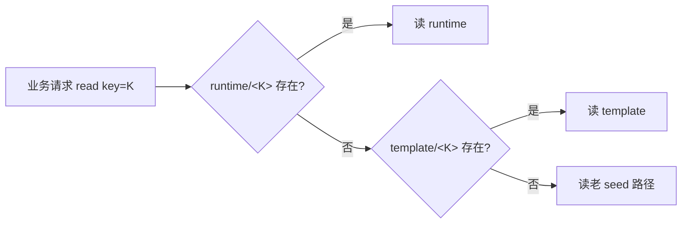
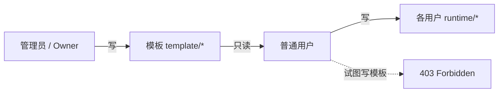

# S3 三层数据隔离 + 模板单一权威：Tego OS v3.0.0 是怎么把治理边界讲清楚的

> 模板归模板，运行时归用户；治理边界，从靠规范升级为靠协议。

---

## v2 时代的两个老问题

如果你在企业里跑过几个数字分身，应该会熟悉这两类问题：

1. **数据切片太粗**：S3 上的所有数据都堆在 `{avatarId}/...` 这一个前缀下，模板、共享运行时、各用户的运行时全混在一起；
2. **配置治理失控**：技能、提示词、模板、工作区配置，谁有权限就能改，改完互相覆盖、版本飘移、回滚困难。

这两件事看起来是「两个问题」，但本质是同一个：**没有一个清晰的「谁能写、写到哪里」的协议**。

v3.0.0 做的事，就是把这条协议从「靠规范、靠口头约定」升级为「靠 S3 路径、靠网关、靠 JWT」的硬约束。

---

## 全新的 S3 命名空间布局

```
{avatarId}/{key}                       ← 分身级模板（admin 可写、所有用户只读）
{avatarId}/shared/{key}                ← shared 模式的运行时备份
{avatarId}/per-user/{userId}/{key}     ← per_user 模式下每个用户的独立备份
```

三件事的核心区别：

| 区域 | 谁能写 | 何时同步 | 何时清理 |
|---|---|---|---|
| 模板 `template/*` | admin / owner（控制台） | 写入即下发到所有副本 | 几乎不清理（需要保留可回滚的历史） |
| `shared` 运行时 | 该分身的所有用户 | 实时 | 分身停用 / 重置时清理 |
| `per-user` 运行时 | 单个用户 | 实时 | 用户离职 / 一键重置时清理 |

这三种数据的生命周期完全不同，混在一起就一定会出问题。v3.0.0 把它们物理上分前缀，是后续所有治理能力的前提。

---

## 三层 fallback 读取

模板和运行时分开后，业务代码读数据怎么办？答案是网关在读侧统一做**三层 fallback**：



这条 fallback 让我们做到：

- **新分身**：直接命中 template，由模板下发；
- **老分身**：走老 seed 路径继续工作，灰度迁移期不阻塞业务；
- **per_user 用户**：runtime 里没有的 key 自动落到 template，新员工拿到的是「最新模板的副本」。

业务代码不需要关心这条 fallback，所有改写都在网关完成。

---

## JWT 携带 instanceUserId

要让 S3 路径自动改写，前提是「网关知道这个请求是哪个用户的」。v3.0.0 在 JWT 里加了一个字段：

```jsonc
{
  "sub": "u_123",
  "tenant": "tnt_xxx",
  "avatar": "av_yyy",
  "instanceUserId": "u_123",   // ← 新字段
  "scope": ["chat:read", "chat:write", ...]
}
```

`instanceUserId` 在网关入口被解出，然后随每个 RPC 调用透传。任何下游服务（包括 S3 网关、技能调度器、记忆服务）都能识别请求归属。

---

## 模板 / 运行时单一权威

权限层是 v3.0.0 最大的协议改动。新模型只允许两种写：



四项设计要点：

### 1. 模板路径只能由 admin / owner 改

只能通过控制台来改，写入即自动 bump 三个版本号：

- `configVersion`：分身配置；
- `workspaceVersion`：工作区结构；
- `skillsVersion`：技能集。

副本看到版本号变化，会主动拉取新模板。

### 2. 网关写侧强制拦截

普通用户的 token 一旦试图写 `template/*` 路径，网关直接 403。这是协议级的硬隔离，不是 UI 级的「按钮灰掉」。

### 3. 双写一致性

控制台改模板时，先 RPC 改本地副本（操作员无延迟可见），再 admin REST 写 S3 模板（其他副本通过心跳最终一致）。这样既保证了控制台体验，又保证了多副本一致性。

### 4. 回填脚本

为了让老分身平滑迁移，v3.0.0 提供了：

```bash
pnpm db:backfill-template
```

幂等地把老分身的 seed 数据迁移到新模板路径。可以反复跑，结果一致。

---

## 一键重置全部用户实例

S3 三层 + 单一权威后，「重置」这件事的语义终于清楚了：

- **模板**：不动（这是分身的「身份」）；
- **shared 运行时**：清空；
- **per-user 运行时**：清空全部用户分支，可选保留某些。

v3.0.0 提供了一键操作，停容器、删编排资源、清 volume、清 deployment 记录，干净彻底。

---

## 对企业的真实意义

这套机制对企业意味着：

### 1. 真正的「我的数据」

同一个分身被一群用户用起来，每个人的会话、记忆、工作区、媒体文件，都是真正「我的」——可独立备份、独立恢复、独立销毁。

### 2. 离职 / 退出干净

员工离职时，只需要清理 `per-user/<userId>/...` 这一支，干净彻底。审计材料里能写出明确的「数据销毁路径」。

### 3. 治理边界终于讲得清楚

「谁能改模板？」「谁能改运行时？」「我能不能把同事的配置覆盖掉？」这些问题在 v3.0.0 之前都靠口头约定，现在全部由协议层强制。

### 4. 灾备 / 合规可按用户切片

恢复某个用户的工作区？只恢复 `per-user/<userId>/...`。
导出某个用户的全部数据？只导出 `per-user/<userId>/...`。
监管审计某个用户的访问？只查 `per-user/<userId>/...`。

这正是受监管行业（政务、金融、医疗）反复要求的能力。

---

## 工程小结

S3 三层 + 单一权威，是 v3.0.0 把「企业数字分身」从一个概念，落到一套**可治理、可审计、可演进**的真实系统的关键转折。

它不是一个让人「眼前一亮」的功能，但它是后续所有更性感的功能（per_user 独享实例、BusinessMonitor 大屏、自动备份恢复、合规审计）能成立的底座。

---

| 渠道 | 方式 |
|------|------|
| 申请演示 | 30 分钟看完 4 个核心场景 |
| 私有化部署咨询 | support@zhama.com |
| 完整平台 | https://app.zhama.com |
