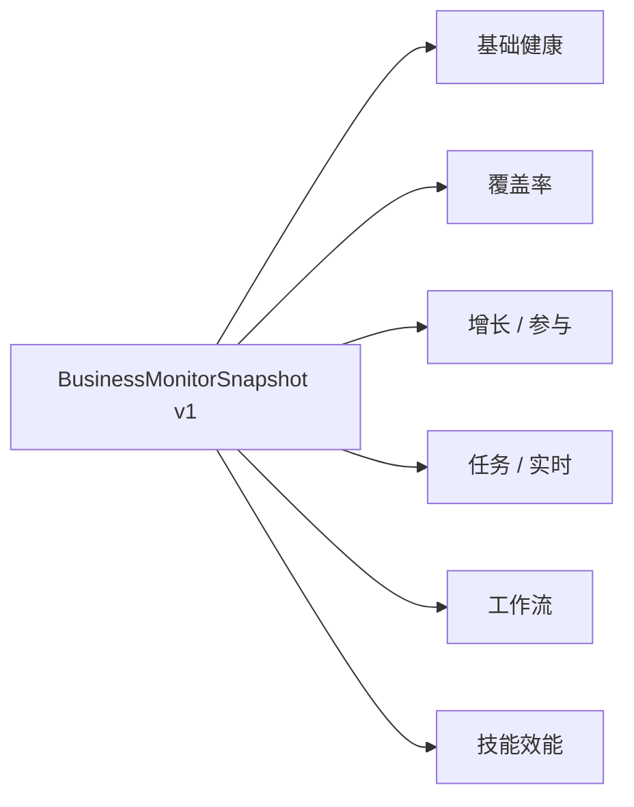

# BusinessMonitor 业务运营大屏：让管理者一屏看清数字分身平台的健康度与业务表现

> 「平台到底有多少人在用、用得怎么样？」这是 v3.0.0 之前我们听到次数最多的一个问题。

---

## 为什么必须做大屏

数字分身一旦在企业里跑起来，几乎所有的 IT 主管、运营总监、业务负责人都会问同一类问题：

- **覆盖**：平台到底真有多少活跃用户？
- **增长**：DAU / WAU / MAU 趋势如何？留存如何？
- **参与**：用户每天用多少次？平均会话多长？
- **任务**：当前队列里有多少任务？哪些技能压力最大？
- **工作流**：自动流转率多少？一次解决率（FCR）多少？
- **技能效能**：哪些技能用得最多、哪些工具被频繁调用？

在 v2.x 时代，这些指标散落在审计日志、单体分析仓、各种 Excel 表里，每次拉数据都要人工 + 脚本 + 大概 1–3 天。**没有大屏，就没有「业务感」**。

v3.0.0 的解法是把所有这些指标聚合为一张快照协议，提供一个开箱即用的大屏。

---

## 核心：BusinessMonitorSnapshot v1 契约

新版 `BusinessMonitorService` 的关键设计是一个统一的快照对象 —— `BusinessMonitorSnapshot v1`：

```jsonc
{
  "version": "v1",
  "timestamp": 1745800000000,
  "tenant": "tnt_xxx",
  "health": { ... },        // 基础健康
  "coverage": { ... },      // 覆盖率（真实活跃用户分母）
  "growth": { ... },        // 增长 / 参与
  "tasks": { ... },         // 任务 / 实时
  "workflow": { ... },      // 工作流（Handoff / FCR / 流转）
  "skills": { ... }         // 技能效能
}
```

一个请求 → 一个快照 → 渲染整张大屏。

这个设计的两个隐含好处：

1. **前后端契约简单**：只有一种 payload，不需要前端组合 6 个接口；
2. **缓存粒度天然**：进程内 LRU 直接缓存这个快照对象，多个面板的高频轮询不会反向打挂数据库。

---

## 六大面板



### 1. 基础健康

审计 / 渠道 / 健康 / 数据源四组卡片。一眼看清「平台心跳是否正常」。

### 2. 覆盖率（Coverage）

**真实活跃用户分母**，不再依赖估算。覆盖率的核心，是把「数字分身真正被人用到」这件事可量化。

### 3. 增长 / 参与（Growth / Engagement）

DAU / WAU / MAU、留存与活跃趋势。可按分身、按租户、按时间段切。

### 4. 任务 / 实时（Tasks / Realtime）

当前任务量与实时负载——队列深度、处理速率、积压率。需要 ops 介入的时候不会等到 24 小时后才发现。

### 5. 工作流（Workflow）

Handoff、FCR（一次解决率）、自动流转率、关闭率。这些是衡量「分身能不能真正替代人」的核心业务指标。

### 6. 技能效能（Skill Effectiveness）

**技能矩阵 + 工具调用统计**。哪些技能被用、被用了多少次、平均成功率、失败原因 top N。

---

## 工程实现：进程内 LRU + 5 秒 TTL

大屏类系统最大的工程风险是：**前端轮询太频繁，反向打挂数据库**。v3.0.0 在 `BusinessMonitorService` 内部加了一层进程内 LRU：

- 缓存键：`(tenant, avatar?, scope, granularity)`；
- 缓存值：完整的 `BusinessMonitorSnapshot v1`；
- TTL：默认 5 秒；
- 命中：直接返回；
- 未命中：从数据源聚合并回填。

这层缓存是「**多面板高频轮询不会反向打挂数据库**」的关键。一个 6 面板的大屏一次轮询如果展开成 6 个独立查询、每秒打 1 次，10 个用户在线就是每秒 60 个查询直接砸到 PG。有了 LRU + 5 秒 TTL，大量重复查询直接命中缓存，DB 压力大幅下降。

---

## 双端上线：ai-studio + dashboard

v3.0.0 在两个端同时上线了独立路由：

- `_authenticated/admin_.business-monitor`（ai-studio 端）：面向运营人员；
- `_authenticated/admin_.business-monitor`（dashboard 端）：面向租户管理员。

两端共享同一个 `BusinessMonitorSnapshot v1` 契约，但展示 / 权限略有差异：

- **ai-studio 端**：可以选择查看具体某个分身的细粒度指标；
- **dashboard 端**：聚焦租户级总览，可下钻到分身。

---

## 配套的 6 个新分析视图

后端同步上线了 6 个分析视图（postgres view），让快照里每个面板的数据都有清晰的物化路径：

- `coverage_view`
- `growth_view`
- `engagement_view`
- `tasks_view`
- `workflow_view`
- `skills_view`

视图本身已经做了基础 join + 预聚合，上层 Service 只做最终编排和缓存。这种「视图层 + 服务层」的分工让指标演进更可控——视图层调整 SQL 不会破坏服务层契约，服务层调整呈现也不需要每次都去碰 SQL。

---

## 给客户的实际价值

### 1. IT 主管：今天能不能交差

「IT 助理」分身上线一周后，BusinessMonitor 就能立刻告诉 IT 主管：

- 真实活跃用户数（不是「注册数」）；
- 工单的一次解决率；
- SLA 趋势；
- 分身的资源占用是否在阈值内。

### 2. 运营总监：分身有没有真正贡献业务

「电商运营」分身上线一个月后，BusinessMonitor 让运营总监看到：

- 每个店铺的活跃度；
- listing-forge 这类高价值技能的调用频次；
- 哪些店铺还没用起来、需要培训；
- 多市场分身的负载差异。

### 3. CTO / 架构师：平台是不是在合理负载下跑

技能效能 + 任务 / 实时面板让架构师能看清：

- 哪些技能调用最频繁；
- 哪些工具调用最容易失败；
- 当前的任务积压；
- 是否需要扩容。

---

## 工程小结

BusinessMonitor 不是一个孤立的「炫酷大屏」，而是 v3.0.0 把「企业数字分身」从「能跑」推进到「可治理、可审计、可演进」的最后一块拼图：

- **per_user** 让分身能放进生产；
- **S3 三层 + 单一权威** 让平台能治理；
- **BusinessMonitor** 让管理者能「看清楚」。

只有这三件事都到位，企业才有底气把 AI 真正放进核心业务流程里。

---

| 渠道 | 方式 |
|------|------|
| 申请演示 | 30 分钟看完 4 个核心场景 |
| 私有化部署咨询 | support@zhama.com |
| 完整平台 | https://app.zhama.com |
