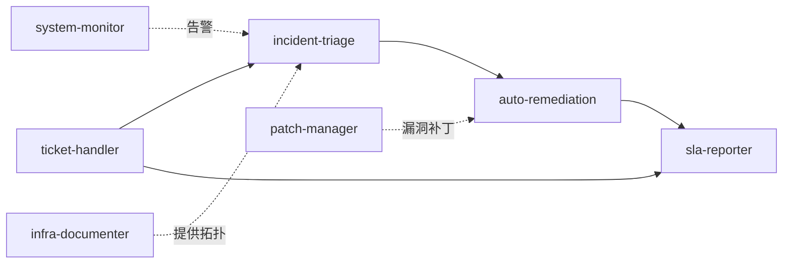
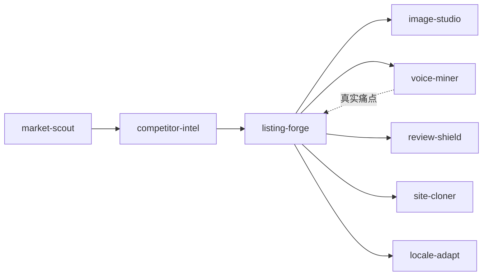

# 16 个开箱即用的 Tego 模板技能：IT 运维 + 跨境电商，一上线就能跑

> 数字分身要「立刻能干活」，最大的门槛从来不是模型，而是没有现成的技能库。

---

## 为什么是「16 个开箱技能」

过去一年我们和大量客户聊过同一类问题：

- 「Tego 数字分身能做什么？」
- 「我们要从零搭一套技能体系，要多久？」
- 「能不能给一个开箱即用的样板？」

数字分身的真实瓶颈，从来不是模型能力，而是：

1. **场景到技能的映射要专业**：不同行业的工作流差异极大，很难抽象成通用技能；
2. **可执行脚本要真的能跑**：「提示词模板」不算技能，必须是带工具调用、带状态机、带回滚的可执行能力；
3. **要能和分身的运行时打通**：技能要能用分身的记忆、能调用 MCP、能向 BusinessMonitor 上报指标。

v3.0.0 一次性给出了一套答案：**16 个 Tego 系列模板技能**，覆盖两条最高频的产业链路：**IT 运维**和**跨境电商**。

---

## IT 运维：11 个技能闭环

### 1. `ticket-handler`：工单全生命周期

受理、分类、优先级、路由、SLA 跟踪。
跟传统 IT 工单系统的区别在于：分身可以自动**根据上下文判断优先级**、自动路由到对应专家组（或自愈技能）、自动触发 SLA 计算。

### 2. `incident-triage`：故障快速诊断

日志分析、指标关联、Runbook 匹配。配合 `system-monitor` 的告警，能在 30 秒内给出「最可能的根因 + 推荐 Runbook」。

### 3. `auto-remediation`：自动修复

服务重启、磁盘清理、缓存刷新（带 dry-run）。所有修复动作默认 dry-run 输出，admin 确认后执行；高频低风险动作可配置自动放行。

### 4. `system-monitor`：主动健康监测

连通性、资源、异常告警分级。把分散的 zabbix / prometheus / 云监控指标拉到分身的工作记忆里，让分身有「全局视野」。

### 5. `infra-documenter`：自动化基础设施文档

发现、清单、拓扑、变更跟踪。把「文档同步落后于现实 6 个月」这件事变成「文档每天自己更新」。

### 6. `patch-manager`：漏洞与补丁生命周期

CVE 比对、风险评估、回滚预案。分身能识别「这台机器需要打这个补丁」，并自动生成回滚预案。

### 7. `sla-reporter`：SLA 合规报告

可用率、MTTR、趋势分析。配合 BusinessMonitor 的工作流面板，可一键导出 SLA 月报。

### 8–11. 其他工程能力

包括但不限于变更评审、发布门禁、容量规划、安全审计的辅助技能。

> 一个 IT 助理分身从「受理 → 分类 → 路由 → 自愈 → SLA 报表」可以完全跑通，不需要从零搭。

---

## 跨境电商：5+ 个技能闭环

### 1. `market-scout`：市场研究

Amazon Best Sellers / Google Trends / TikTok 三平台交叉验证，识别「真热」vs「短热」。

### 2. `competitor-intel`：竞品分析

抓取 / 分析评论、识别弱点、生成攻击策略。把传统电商运营花一周做的竞调，压缩到 30 分钟。

### 3. `listing-forge`：Listing 撰写

自动从分身记忆中读取竞品弱点，做 SEO 优化的 Listing 文案。**关键差别**：不是「按模板填空」，而是分身能记住该店铺、该品类、该市场的历史数据。

### 4. `image-studio`：主图 / 场景图

白底图、合规化、AI 生成。

### 5. `video-maker`：15 秒 UGC 短视频

适配 TikTok / Reels。

### 6. `voice-miner`：用户痛点挖掘

Reddit / 论坛真实用户痛点挖掘，反哺 Listing 与产品迭代。

### 7. `review-shield`：差评分类与合规回复

分类 + 自动回复 + 升级标记。运营总监设定「合规边界」（比如「不允许承诺退款」），分身在边界内自动作答。

### 8. `site-cloner`：竞品落地页结构克隆

把竞品落地页的结构（不是内容）抽取为可复用骨架，加速自有页搭建。

### 9. `locale-adapt`：多市场本地化

文化适配、本地关键词、市场化 SEO。配合 `per_user` 实例，每个店铺号 / 每个市场都有独立的运行时上下文，记忆不串扰。

> 一个跨境电商分身从「选品 → 竞调 → Listing → 主图 / 视频 → 差评回复 → 多市场本地化」全链路可执行。

---

## 与 v3.0.0 其他能力的联动

这 16 个技能不是独立堆出来的，而是**深度依赖** v3.0.0 的几个底层能力：

### 与 `per_user` 联动

- IT 运维场景：每位 IT 同事使用「IT 助理」分身时，自己的工单上下文、Runbook 偏好、变更记录都在自己的运行时；
- 跨境电商场景：每个店铺号在「电商运营」分身上有独立运行时，竞调结果、品牌词库、历史 listing 互不串扰。

### 与 S3 三层 + 单一权威联动

- 技能本身（`SKILL.md`、`scripts/`、配置）放在 `template/*` 路径，由管理员统一治理；
- 用户使用过程中产生的工作区数据（草稿、生成图、临时表）落在 `per-user/<userId>/...`；
- 升级技能版本时只需更新 template，所有用户实例下次启动时自动拉取，不会冲突。

### 与 BusinessMonitor 联动

- **技能效能面板**直接展示这 16 个技能的调用频次、平均成功率、失败 top N；
- **工作流面板**展示 `ticket-handler → incident-triage → auto-remediation` 这条链路的一次解决率、自动流转率；
- **任务面板**展示当前 `auto-remediation` / `image-studio` 这类相对重的技能的实时负载。

---

## 上线节奏建议

如果你刚开始把分身放进生产，我们建议这样上：

1. **第一周**：开 1 个分身、装 1 个技能、5 个用户（小灰度）；
2. **第二周**：装 3–5 个技能，扩 20 个用户，开 `per_user`；
3. **第三周**：接 BusinessMonitor 大屏，让 IT / 运营主管开始看数据；
4. **第四周**：根据 BusinessMonitor 的「技能效能」决定下一批装哪些技能。

不要一上来就装 16 个。**让分身在真实业务里被使用 → 出数据 → 出反馈 → 再装新技能**，是落地最快的路径。

---

## 工程小结

「16 个开箱即用的技能」表面看是一份数字，本质是 v3.0.0 在交付侧的承诺：

- **不必再花 2–3 个月从零搭建技能体系**；
- **每个技能都有可执行脚本**，能真正调用工具、写文件、调 API；
- **每个技能都和 per_user / 模板治理 / BusinessMonitor 联动**，能放进真实业务流程里；
- **技能体系会持续扩**，欢迎客户把行业 know-how 沉淀回来变成新模板。

把数字分身从「能聊天」推进到「能干活」，这套技能库是中间最关键的一步。

---

| 渠道 | 方式 |
|------|------|
| 申请演示 | 30 分钟看完 4 个核心场景 |
| 行业方案咨询 | support@zhama.com |
| 完整平台 | https://app.zhama.com |
